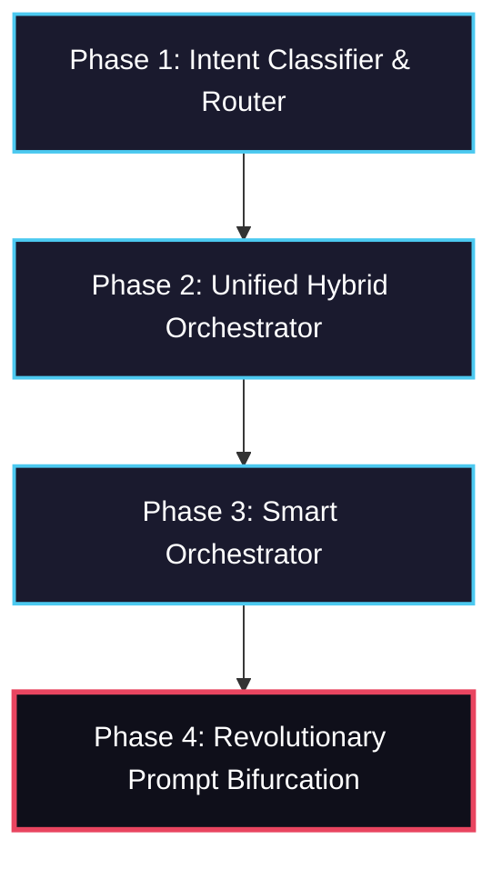

# Edge AI Intent Classifier & Orchestrator: Evolution & Implementation Report

This comprehensive implementation report tracks the evolutionary journey of the **Edge AI Intent Classifier & Orchestration System**. What began as a zero-shot intent classifier and dashboard has matured into a multi-phase, state-of-the-art hybrid on-device/cloud routing ecosystem, culminating in a 100% offline, self-refining dual-role compiler architecture.

---

## 1. Executive Summary & Project Progression

The system is designed to solve the critical trade-offs of modern LLM systems: **privacy, cost, latency, and reliability**. By combining lightweight local edge models with robust cloud APIs and advanced task decomposition algorithms, the project ensures optimal compute efficiency and graceful degradation.

The system's development progressed through four distinct architecture phases:



| Phase | Core Mechanism | Local Model | Cloud Model | Execution Mode | Key Benefit |
| :--- | :--- | :--- | :--- | :--- | :--- |
| **1. Intent Classifier** | Zero-Shot Classifier + Deterministic Router | Qwen2-0.5B (GGUF) | Grok API | Single Route (Local or Cloud) | Basic task routing, zero cloud costs for simple tasks |
| **2. Unified Orchestrator** | Sentence Tokenization + Hierarchical Graph | Qwen2-0.5B (GGUF) | Grok API | ThreadPool parallel execution | Task decomposition and parallelized hybrid flows |
| **3. Smart Orchestrator** | Bartender-based Decomposer & Tracker | Qwen-1.8B (GGUF) | Grok API | Dynamic telemetry execution | Intelligent task routing with latency tracking |
| **4. Revolutionary Bifurcation** | LLMCompiler + Self-Refining Dual-Role Agent | Qwen2-0.5B / Qwen-1.8B (GGUF) | None (100% Offline) | Dependent DAG execution with Refiner | Complete data privacy, self-correcting execution |

---

## 2. Phase 1: Edge AI Intent Classifier & Dashboard

### 2.1. System Workflow & Architecture
The initial baseline leverages a zero-shot classifier as the "router brain" to intercept user prompts and route them in their entirety to the best execution engine:
1. **Input Reception**: User prompt is ingested via Streamlit (`streamlit_app.py`).
2. **Intent Classification** (`classifier.py`): Leverages `typeform/distilbert-base-uncased-mnli` (~268MB footprint) to assign confidence scores over 8 predefined intents:
   - *Intents*: `summarize`, `translate`, `analyze_data`, `generate_code`, `multi_step`, `ambiguous`, `urgent`, `simple_query`.
   - *Heuristic Post-Processing*: Regex rules boost `multi_step` when words like "and" or "then" exist.
3. **Deterministic Routing** (`router.py`):
   - **Urgent Task** (`urgent > 0.5`) → Routes to **Cloud LLM** (Grok).
   - **Low Confidence** (`< 0.55`) → Routes to **Cloud LLM** (Grok) for deep reasoning.
   - **High Confidence & Simple** (`>= 0.75` for translate, summarize, simple) → Routes to **ODA** (Local Qwen2-0.5B).
   - **High Confidence & Complex** (`>= 0.75` for analysis, code) → Routes to **Cloud LLM**.
4. **Execution & Fallback** (`grok_cloud.py` & `qwen_oda.py`):
   - Primary cloud calls use the Grok API with automatic model failover (tries `grok-3-mini`, `grok-3`, `grok-2-1212`, `grok-2-latest`, etc.).
   - If the API key is missing, network times out, or Grok fails, `grok_cloud.py` automatically cascades the request down to `qwen_oda.py` for offline Qwen fallback, maintaining presentation uptime.
5. **Real-time Analytics**: Writes metadata (timestamp, prompt, selected route, latency, status) to `logs.csv` for Streamlit reporting.

---

## 3. Phase 2: Unified Edge AI + Bifurcation System

To handle multi-step prompts (e.g., *"Summarize this document, extract the key names, and then write a draft letter"*), Phase 2 introduced true **Task Decomposition and Parallel Execution** through the `unified_orchestrator` and `core/hybrid_orchestrator.py`.

```
                    ┌─────────────────────────┐
                    │       User Prompt       │
                    └────────────┬────────────┘
                                 │
                   ┌─────────────▼─────────────┐
                   │  Hierarchical Decomposer  │
                   │ (NLTK sentence tokenizer) │
                   └─────────────┬─────────────┘
                                 │
                   ┌─────────────▼─────────────┐
                   │  Coreference Dependency  │
                   │  (Shared Entity Analyzer) │
                   └─────────────┬─────────────┘
                                 │
                   ┌─────────────▼─────────────┐
                   │   Agglomerative Clustered │
                   │   Task Bifurcation DAG    │
                   └─────────────┬─────────────┘
                                 │
                  ┌──────────────┴──────────────┐
                  ▼                             ▼
       ┌────────────────────┐         ┌────────────────────┐
       │   Local Task n1    │         │   Local Task n2    │
       │   (Qwen2-0.5B)     │         │   (Qwen2-0.5B)     │
       └──────────┬─────────┘         └──────────┬─────────┘
                  │                              │
                  └──────────────┬───────────────┘
                                 │
                   ┌─────────────▼─────────────┐
                   │    Stitcher & Polisher    │
                   │    (Grok Output Fusion)   │
                   └───────────────────────────┘
```

### 3.1. Advanced Task Bifurcation
Instead of executing the prompt as a monolith, `HybridOrchestrator` splits the query into structured dependency nodes:
- **Sentence Tokenization & Coreference Resolution**: Leverages NLTK to parse prompt sentences. If two sentences share coreference terms (entities), a dependency edge `depends_on` is injected.
- **Agglomerative Clustering**: Synthesizes redundant or highly similar sentences into single multi-stage cluster tasks using Cosine Affinity to minimize redundant model runs.
- **Topological Sorting**: Arranges DAG nodes (`n1`, `n2`, `n3`...) in an acyclic topological sequence.

### 3.2. Parallel Thread Pool Execution
- Submits ready tasks (nodes with zero pending dependencies) to a `ThreadPoolExecutor` (max 4 workers).
- Dependent tasks block until parent futures resolve, injecting resolved parent text outputs as a context preamble for the child task.
- **Conflict Resolution & Polishing**: Checks for negative expressions in overlapping results. If detected, Grok is triggered to resolve conflicts and polish the final stitched output to match the original parent prompt.
- **Telemetry**: Real-time rendering of the generated Bifurcation DAG in Streamlit using Graphviz.

---

## 4. Phase 3: Smart LLM Orchestrator

The **Smart LLM Orchestrator** (`smart_orchestrator/`) standardizes execution flows by incorporating:
- **Bartender-style Prompt Decomposition**: Translates long prompts into highly structured task objects.
- **Dynamic Routing Engine**: Assigns specific tasks to either Local (Qwen-1.8B) or Cloud (Grok API) based on resource capabilities.
- **Live Visual Telemetry**: Renders step-by-step progress, latency metrics, and execution states in a custom dashboard view.

---

## 5. Phase 4: Revolutionary Prompt Bifurcation (LLMCompiler)

Phase 4 (`revolutionary_orchestrator/`) represents the pinnacle of the codebase: a **100% offline, privacy-first, self-correcting agent** utilizing a dual-role (Planner, Executor, Refiner) LLMCompiler architecture.

```
       ┌───────────────────────────────┐
       │      User Complex Prompt      │
       └───────────────┬───────────────┘
                       │
         ┌─────────────▼─────────────┐
         │     Regex Pre-Router      │ (Heuristic sequence detection)
         └─────────────┬─────────────┘
                       │
         ┌─────────────▼─────────────┐
         │   🧠 TaskPlanner (GGUF)   │ (Low temp, zero-shot structured JSON)
         └─────────────┬─────────────┘
                       │
                       ├──────────────────────────┐
                       │                          │ (Success)
         ┌─────────────▼─────────────┐            │
         │   ⚡ TaskExecutor (GGUF)  │            │
         └─────────────┬─────────────┘            │
                       │                          │
                   (If Errors / Short Outputs)    │
                       │                          │
         ┌─────────────▼─────────────┐            │
         │   🔁 TaskRefiner (GGUF)   │            │
         └─────────────┬─────────────┘            │
                       │ (Improved DAG)           │
         ┌─────────────▼─────────────┐            │
         │   ⚡ TaskExecutor (GGUF)  │            │
         └─────────────┬─────────────┘            │
                       │                          │
                       ├──────────────────────────┘
                       │
         ┌─────────────▼─────────────┐
         │  Synthesized Output UI    │
         └───────────────────────────┘
```

### 5.1. The Planner Brain (`planner.py`)
- **Model Parameters**: Fast local GGUF running at a low temperature `0.1` and `seed=42` to guarantee high determinism.
- **Regex Guardrails**: Includes a regex pre-router to check for sequential markers (e.g., *"First... Then... Finally..."*). If present, it bypasses the LLM planning call to instantly construct a flawless sequential DAG, protecting small CPU models from context drift.
- **JSON Structured Output**: Employs zero-shot format templates representing tasks as:
  ```json
  {
    "nodes": [
      { "id": "n1", "task": "Task description here", "model": "qwen" },
      { "id": "n2", "task": "Dependent task description", "model": "qwen", "depends_on": ["n1"] }
    ]
  }
  ```
- **Copycat Guardrails**: Compares generated tasks with prompt examples; if the model copies the templates verbatim, it defaults to a single-node fallback execution.

### 5.2. The Context-Aware Executor (`executor.py`)
- **Model Parameters**: Run at `temperature=0.3` to facilitate rich, fluent, and creative synthesis.
- **Topological Solver**: Resolves dependency paths and resolves deadlocks by wiping unresolved dependency lists when cyclics or deadlocks are detected.
- **Thread-Safety & Sequential Preamble**: Because local C++ inference engines (`llama-cpp-python`) are not natively thread-safe, execution runs sequentially. For each task, a complete context preamble is dynamically built, joining:
  1. PDF content (truncated gracefully to the first 2,000 characters).
  2. Sequential outputs of all completed parent tasks marked under `depends_on`.
- **Global Context Injection**: PDF text is globally injected to every single task, assuring that the local engine retains absolute context awareness.

### 5.3. The Self-Refining Optimizer (`refiner.py`)
If any task in the execution chain encounters a problem, the pipeline triggers **Self-Refinement**:
- **Defect Detection**: Evaluates execution outputs against strict performance heuristics:
  - Task threw an exception (e.g., JSON error, GGUF crash).
  - Task produced an output that was too short (under 15 words).
  - Task did not execute due to preceding node state.
- **Re-Compilation**: Feeds the original DAG and the defect feedback list into `refiner.py` (`temp=0.1`).
- **Correction Rules**: The refiner automatically rewrites the DAG:
  1. Splits failed tasks into smaller, less complex sub-tasks.
  2. Injects intermediate context-gathering steps for short outputs.
  3. Preserves successful tasks intact to conserve memory.
  4. Yields an optimized DAG for a seamless second-pass execution.

---

## 6. Development Triumphs & Edge-Deployment Optimization

To enable this system to run fluidly on resource-constrained environments (like local CPUs and **Streamlit Community Cloud**), several deep optimization strategies were applied:

### 6.1. Streamlit Cloud Memory Optimization & Thread Safety
- **Module Fallback Engine**: Streamlit Cloud restricts C++ compilation for custom bindings like `llama-cpp-python`. The system was engineered to degrade gracefully: `router.py` automatically catches compiler load errors, transparently switching tasks to the Cloud (Grok API) without crashing the application.
- **CPU-Only PyTorch**: `requirements.txt` was configured with `--extra-index-url https://download.pytorch.org/whl/cpu` to reduce container image footprint and bypass memory exhaustion crashes during Streamlit build phases.
- **Model Cache Resource**: Models are initialized under `@st.cache_resource` to guarantee they load exactly once across all active websocket connections.
- **Shared LLM Instances**: In the revolutionary orchestrator, the **Planner, Executor, and Refiner** all share a single `Llama` memory context instance when loading identical GGUF paths. This cuts active RAM requirements in half (saving ~300MB-500MB), allowing the entire system to run within 1GB RAM.
- **Inference Locks**: Added thread-safe `threading.Lock` mechanisms in `TaskExecutor` to serialize local model completions, preventing memory corruption or segmentation faults during parallel requests.

---

## 7. Future Horizon & Roadmap

- **Dynamic Hardware Acceleration**: Automatically detect and load CUDA, ROCm, or Apple Metal DLLs to utilize local GPUs when available.
- **Dataset Generation & Training**: Utilize execution outputs inside `logs.csv` to expand `training/domain_dataset.json` for custom DistilBERT fine-tuning.
- **Continuous Human Feedback (RLHF)**: Add like/dislike buttons inside the Streamlit logging panel to dynamically tune intent classification thresholds based on user reviews.
