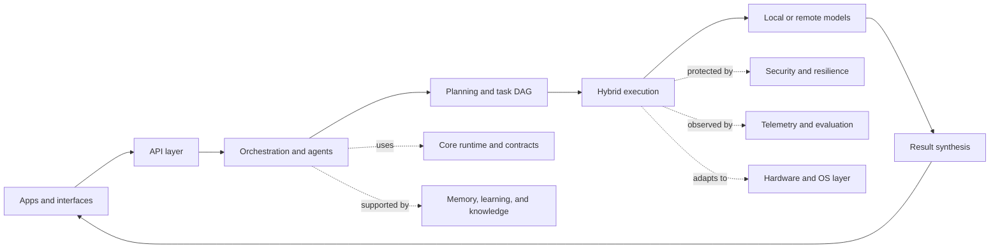

# DAIOPH

### Local-first AI, with the pieces to think, route, and act.

**DAIOPH (Distributed Adaptive Intelligence Operating Platform)** is an evolving Python platform for running AI workflows across local models and cloud services. It began with edge intent classification and hybrid inference; its current architecture brings that workflow into a wider system of planners, agents, tools, memory, learning, and platform services.

The goal is practical: keep routine and privacy-sensitive work close to the device, bring in remote models when configured, and give complex requests a path from planning through execution to a composed result. DAIOPH includes four user-facing orchestration applications alongside a growing set of reusable platform modules.

> **Project status:** Active development. The repository contains components at different levels of maturity; platform-wide integration and evaluation are ongoing. This README describes the intended architecture and available entry points, not a claim that every subsystem is production-ready.

## Progress so far

- Established the Python project foundation, dependency configuration, and application entry points.
- Built four orchestration experiences, from intent-based routing to hybrid DAG execution and local planning with refinement.
- Added agent roles, a tool framework, and plugin scaffolding for extending the platform.
- Developed security and resilience foundations, including access control, privacy, audit events, retries, fallbacks, and recovery.
- Expanded the architecture across memory, knowledge retrieval, learning, multimodal processing, federation, and hardware adaptation; integration continues.

## How the platform fits together

DAIOPH is organized as layers, with a request moving from an interface into routing and orchestration, then through model execution and supporting platform services.



At a high level, a request can be classified and routed to an edge, cloud, or hybrid path. More involved prompts can be decomposed into a task graph, whose independent work can run in parallel. Execution results are then assembled for the user. The selected path depends on the application, configuration, available models, and credentials.

The design is guided by a few principles:

- **Local-first execution:** support on-device inference and offline workflows where the selected application and model permit them.
- **Adaptive routing:** choose an execution path based on task intent and available compute or services.
- **Composable subsystems:** keep orchestration, models, memory, tools, and platform services in separate modules with defined contracts.
- **Resilient operation:** provide mechanisms such as retries, circuit breakers, fallback, health monitoring, and recovery.
- **Explicit capabilities:** integrations depend on their configured services and dependencies; availability should be surfaced rather than assumed.

For the detailed layer map and request flow, see [ARCHITECTURE.md](ARCHITECTURE.md). For the history of the original four orchestration phases, see [IMPLEMENTATION_REPORT.md](IMPLEMENTATION_REPORT.md).

## Applications

The repository carries forward four related orchestration applications:

- **Intent classifier and dashboard** — `streamlit_app.py` classifies individual prompts, routes requests, and presents telemetry.
- **Unified orchestrator** — `unified_orchestrator/app.py` coordinates multi-step work using task decomposition and parallel execution.
- **Smart orchestrator** — `smart_orchestrator/app.py` combines prompt decomposition, task routing, and execution metrics.
- **Prompt bifurcation / LLMCompiler** — `revolutionary_orchestrator/app.py` explores a planner–executor–refiner workflow designed for local execution.

The broader platform also includes REST, WebSocket, event, and gRPC API areas; Streamlit, CLI, web, desktop, and mobile app modules; and an MCP server entry point. Some surfaces are scaffolding or evolving integrations. Review their configuration and implementation before relying on them in a deployment.

## Platform map

- **Runtime and execution:** `core/`, `runtime/`, `execution/`, `orchestration/` — boot, contracts, scheduling, planning, DAG execution, routing, and synthesis.
- **Agents and extensions:** `agents/`, `tools/`, `plugins/` — role-based agents, categorized tools, and plugin scaffolding.
- **Models and intelligence:** `models/`, `intelligence/`, `liquid_core/` — model providers, intent and reasoning components, and adaptive model work.
- **Context and adaptation:** `memory/`, `knowledge/`, `learning/`, `federated/` — state, retrieval and provenance, feedback and continual learning, and federated learning components.
- **Input and environment:** `multi_modal/`, `multimodal/`, `hardware/`, `os_layer/`, `network/` — modality-specific processing, hardware awareness, OS integration, and distributed connectivity.
- **Platform quality:** `security/`, `resilience/`, `observability/`, `evaluation/`, `benchmarks/`, `tests/` — security controls, recovery mechanisms, telemetry, and evaluation resources.
- **Interfaces and operations:** `APIs/`, `apps/`, `user_interface/`, `configs/`, `deployment/` — service surfaces, user applications, configuration, and deployment assets.

## Get started

### Requirements

- Python 3.11 or later
- The dependencies for the application you plan to run
- Optional: an xAI API key for cloud-backed inference
- Optional: local model files and inference dependencies for on-device workflows

### Install

```bash
python -m venv .venv
```

Activate the environment, then install dependencies:

```powershell
# Windows PowerShell
.venv\Scripts\Activate.ps1
pip install -r requirements.txt
```

```bash
# macOS or Linux
source .venv/bin/activate
pip install -r requirements.txt
```

Copy `.env.example` to `.env` and configure the values needed by your selected workflow. For Grok-backed inference, set `GROK_API_KEY`. Local inference settings such as Qwen quantization and hardware tuning are documented in the example file. Keep credentials and private data out of version control.

### Launch an orchestration app

```bash
streamlit run streamlit_app.py
```

Or start one of the other applications:

```bash
streamlit run unified_orchestrator/app.py
streamlit run smart_orchestrator/app.py
streamlit run revolutionary_orchestrator/app.py
```

Docker assets are provided in `Dockerfile` and `docker-compose.yml`. Model availability, credentials, and optional system dependencies determine which routes are usable in a given environment.

## Development and evaluation

Dependency configuration is maintained in `requirements.txt` and `pyproject.toml`; `uv.lock` records the uv lock state. The repository includes test, evaluation, and benchmark areas. Since subsystem coverage and integration vary, report the specific application, model, configuration, and evaluation procedure alongside any performance or quality result.

## Further reading

- [Architecture](ARCHITECTURE.md)
- [Implementation report](IMPLEMENTATION_REPORT.md)
- [Changelog](CHANGELOG.md)
- [Contributing](CONTRIBUTING.md)
- [Security](SECURITY.md)
- [License](LICENSE)
