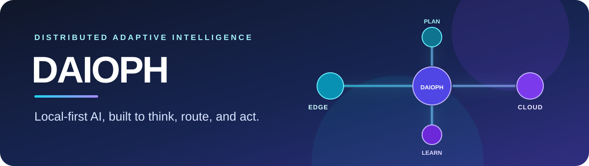
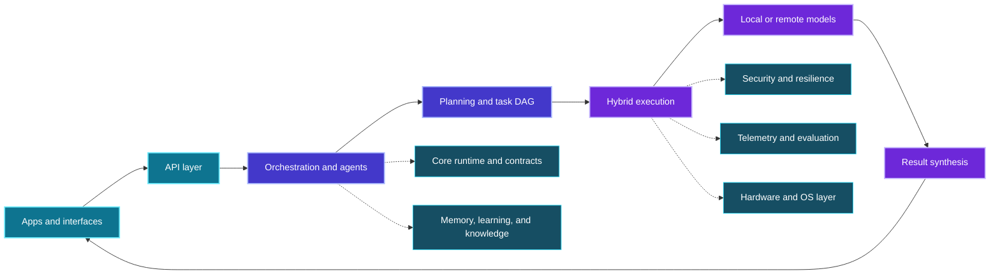

<div align="center">
  
</div>

<div align="center">
  
  
  
</div>

<br />

**DAIOPH (Distributed Adaptive Intelligence Operating Platform)** is a Python platform for coordinating AI work across local models and cloud services. It brings together intent routing, task planning, agent execution, and supporting services for memory, learning, tools, and system resilience.

The project began with edge inference and hybrid orchestration. Its current architecture extends that foundation into a modular platform, while individual subsystems continue to mature and integrate.

> **Research and development status** · Active development. Capabilities vary by module and application; the architecture describes the platform direction, and should not be read as a claim that every component is production-ready.

## Progress at a glance

- Set up the Python project foundation, dependency management, and application entry points.
- Developed four orchestration applications, from intent routing to task graphs and local planning with refinement.
- Added role-based agents, a tool framework, and plugin scaffolding.
- Built security and reliability foundations, including access control, privacy, auditing, retries, fallback, and recovery.
- Extended the platform into memory, knowledge retrieval, learning, multimodal processing, federation, and hardware adaptation.

## Architecture

Requests move through a simple idea: **understand → plan → execute → assemble**. Depending on the workflow and available configuration, execution can use local inference, cloud services, or a hybrid route.



Core design themes are local-first inference where supported, adaptive routing, modular subsystem contracts, resilient execution, and explicit reporting of integration requirements.

## Choose an application

| Workflow | Entry point | What it explores |
|---|---|---|
| Intent routing | `streamlit_app.py` | Classify prompts, select a route, and inspect execution telemetry. |
| Unified orchestration | `unified_orchestrator/app.py` | Decompose multi-step work and coordinate parallel tasks. |
| Smart orchestration | `smart_orchestrator/app.py` | Combine decomposition, routing, and task metrics. |
| Prompt bifurcation | `revolutionary_orchestrator/app.py` | Explore local planning, execution, and refinement. |

The repository also contains REST, WebSocket, event, and gRPC API areas; Streamlit, CLI, web, desktop, and mobile application modules; and an MCP server entry point. Some are evolving or scaffolded surfaces.

## Quick start

**Requirements:** Python 3.11+, plus any model files and optional services required by your chosen workflow.

```bash
python -m venv .venv
```

Activate the environment and install dependencies:

```powershell
# Windows PowerShell
.venv\Scripts\Activate.ps1
pip install -r requirements.txt
```

```bash
# macOS / Linux
source .venv/bin/activate
pip install -r requirements.txt
```

Copy `.env.example` to `.env`. Set `GROK_API_KEY` for Grok-backed inference; local Qwen settings are also described in the example. Then launch the primary dashboard:

```bash
streamlit run streamlit_app.py
```

Other orchestration apps can be started with `streamlit run <entry-point>`. Docker files are provided in `Dockerfile` and `docker-compose.yml`.

<details>
<summary><strong>Explore the codebase</strong></summary>

- **Runtime & orchestration:** `core/`, `runtime/`, `execution/`, `orchestration/`
- **Agents & extensions:** `agents/`, `tools/`, `plugins/`
- **Models & intelligence:** `models/`, `intelligence/`, `liquid_core/`
- **Context & adaptation:** `memory/`, `knowledge/`, `learning/`, `federated/`
- **Modalities & environment:** `multi_modal/`, `multimodal/`, `hardware/`, `os_layer/`, `network/`
- **Trust & evaluation:** `security/`, `resilience/`, `observability/`, `evaluation/`, `benchmarks/`, `tests/`
- **Interfaces & operations:** `APIs/`, `apps/`, `user_interface/`, `configs/`, `deployment/`

</details>

## Development notes

Dependencies are listed in `requirements.txt` and `pyproject.toml`; `uv.lock` records the uv lock state. Test, evaluation, and benchmark resources are included, but coverage and integration differ across subsystems. When sharing performance or quality results, report the exact application, model, configuration, and evaluation procedure.

## Project links

[Super README / complete project guide](docs/PROJECT_GUIDE.md) · [Architecture](ARCHITECTURE.md) · [Implementation report](IMPLEMENTATION_REPORT.md) · [Changelog](CHANGELOG.md) · [Contributing](CONTRIBUTING.md) · [Security](SECURITY.md) · [License](LICENSE)
