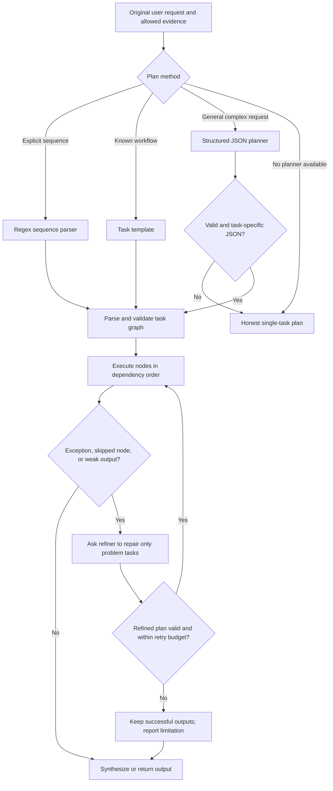
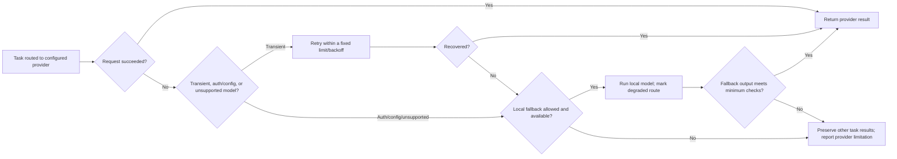
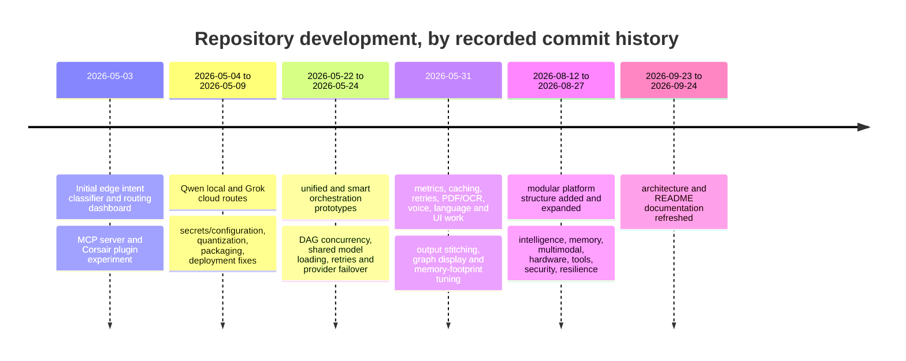
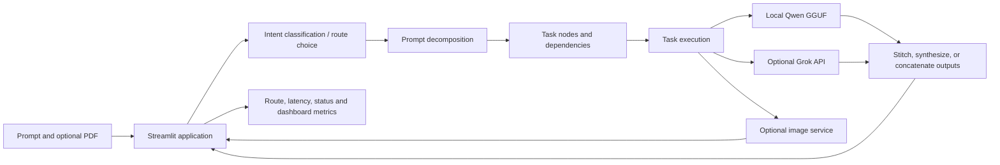
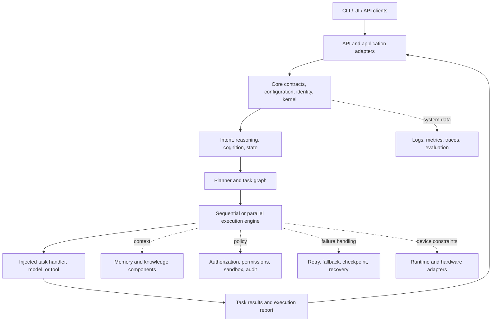
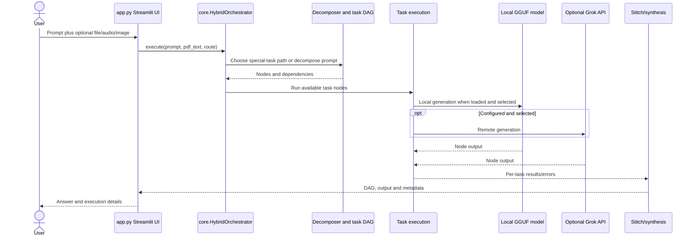
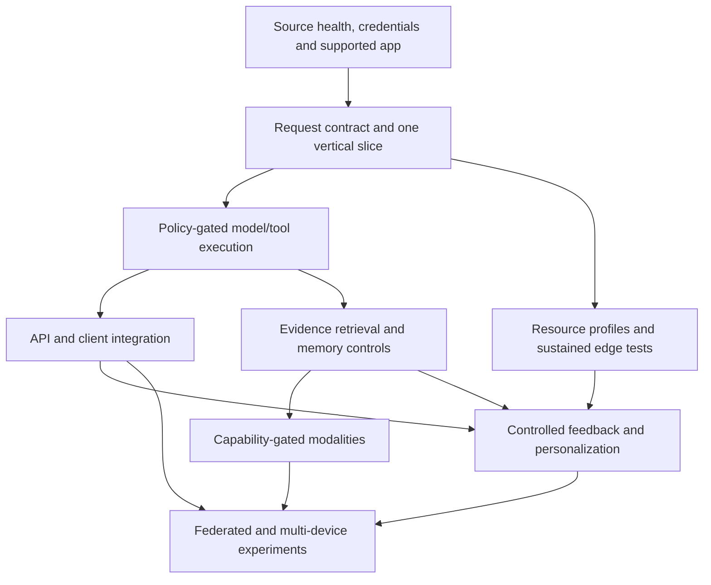

# DAIOPH: Project Guide

This guide describes the code in this repository, how its main workflows fit together, what the project history says changed, and which parts are still designs or scaffolds. It aims to let a new contributor orient themselves without treating every directory or architecture diagram as a finished feature.

## Identity and scope

DAIOPH is expanded in current docs as **Distributed Adaptive Intelligence Operating Platform**. Older files use **Distributed Adaptive Intelligence Orchestration Platform**, **for Humans**, or the original product description, **Edge AI Intent Classifier & Orchestration System**. That naming drift reflects a real change in scope: the project began as a Streamlit prompt router for local Qwen and optional Grok inference, then grew a family of orchestration prototypes and a much larger modular platform layout.

The version marker is `0.1.0`; Python is pinned to 3.11. The repository is best understood as two related bodies of work:

1. **Original runnable application lineage:** root Streamlit apps and modules (`streamlit_app.py`, `app.py`, `classifier.py`, `router.py`, `core/hybrid_orchestrator.py`, `qwen_oda.py`, `grok_cloud.py`) implement prompt routing, local/cloud model calls, task decomposition, and dashboards. They have their own assumptions and duplicated logic.
2. **Platform architecture and subsystem modules:** `core/`, `intelligence/`, `orchestration/`, `memory/`, `learning/`, `knowledge/`, `security/`, and related packages define a broader system. Some modules have concrete logic and tests; other modules remain placeholders or are not wired into the older apps.

The architecture is therefore a direction and a collection of building blocks, not evidence that every capability is available through one unified production runtime.

## What problem it explores

For a user request, DAIOPH explores how to determine intent and execution route, break compound work into steps, run suitable steps on a device or an optional cloud service, carry task context between steps, recover from failures, and report the result. The design tries to balance:

- **Privacy:** prefer local processing when the local model/capability is usable; make remote services optional/configured.
- **Cost and latency:** avoid sending every request to a remote model; parallelize independent work where safe.
- **Capability:** use cloud inference or specialized tools when local execution is unavailable or inadequate.
- **Reliability:** retry transient faults, route around unavailable components, and preserve partial results.
- **Adaptability:** observe device resources and user feedback, then eventually tune routing or model behavior.

Those are goals. Whether a given app follows them depends on its code path and configuration.

## The idea in depth: adapt the work to the situation

DAIOPH’s central idea is that an AI assistant should be treated as an **execution system**, not just a text box connected to one large model. A prompt is a request with constraints: it may be private, urgent, compound, document-grounded, expensive to send remotely, too difficult for a small on-device model, or impossible because a dependency is missing. A useful system must understand enough of those constraints to choose a suitable method, expose the method it chose, and have a plan for what happens when the method fails.

The project’s “adaptive” claim therefore has several meanings. At the request level, the system can choose a route or decompose work. At the task level, a graph can send different nodes to different handlers and pass earlier results forward. At the device level, model size, quantization, thread count, context length, and reasoning depth can be adjusted to resources. At the interaction level, feedback and memory modules provide a proposed path to personalization. At the fleet level, federation proposes sharing updates without uploading raw conversations. These are separate adaptation loops with separate risks; one should not describe them all as a single already-working self-learning loop.

The guiding design hypothesis is **use the least costly method that can meet the task’s quality, privacy, and reliability requirements, while preserving a higher-capability escape path**. For a one-sentence rewrite, loading a planner, several agents, and a cloud model is wasteful. For a long document analysis, a small local model may need task splitting and explicit context. For sensitive information, a remote route may be disallowed even if it is more capable. For a remote outage, a local answer may be lower quality but better than a crash. The right decision depends on a policy and constraints, not simply on whether a prompt “looks hard.”

That framing also explains why the repository has many support areas: planning controls task structure; routing chooses an execution resource; memory supplies relevant prior context; knowledge retrieval supplies evidence; tools take bounded actions; verification checks outputs; resilience handles faults; observability explains what happened; and learning proposes how future behavior can improve. The benefit exists only when these components are connected in a real application and their policies agree. A local model plus a remote OCR or image service is not a fully local workflow; a privacy package that is not called by the chat path does not protect that path.

### Full target workflow: from user intent to improvement

The following is the intended end-to-end DAIOPH model. It combines mechanisms found across the repository and explicitly marks loops that are still proposed or only partially wired. The user request flows left to right; optional context and learning services are supporting paths.

```mermaid
flowchart TD
    U[User request: text, file, voice, image, video, sensor] --> ENTRY[App or API entry point]
    ENTRY --> ID[Session, identity, configuration and feature policy]
    ID --> CONSENT{Input processing and remote-use policy permits this path?}
    CONSENT -- No --> LOCAL_ONLY[Disable remote handlers; explain unavailable capability]
    CONSENT -- Yes --> MODAL[Normalize modality: extract text, OCR, transcribe, sample frames]
    LOCAL_ONLY --> MODAL
    MODAL --> CTX[Build task context from request, supplied files and allowed memory]
    CTX --> INTENT[Detect intent, task type and uncertainty]
    INTENT --> SIMPLE{One bounded task with enough confidence?}
    SIMPLE -- Yes --> DIRECT[Build one task]
    SIMPLE -- No --> PLAN[Decompose: rules/templates or injected/local planner]
    PLAN --> VALIDATE[Validate task IDs, dependencies, route hints and policy]
    VALIDATE --> VALID{Plan valid and safe?}
    VALID -- No --> PLANFAIL[Repair, simplify to one task, or ask for clarification]
    PLANFAIL --> DIRECT
    VALID -- Yes --> DAG[Schedule ready nodes; preserve dependencies]
    DIRECT --> DAG
    DAG --> ROUTE[Choose handler using policy, privacy, capability and resource limits]
    ROUTE --> DEVICE{Local capability fits resource budget?}
    DEVICE -- Yes --> EDGE[Run local model or local tool]
    DEVICE -- No --> REMOTE_OK{Remote use allowed and configured?}
    REMOTE_OK -- Yes --> REMOTE[Run approved cloud model/service]
    REMOTE_OK -- No --> DEGRADED[Choose smaller/local fallback, defer, or return limitation]
    EDGE --> OUTCOME{Task succeeded and output usable?}
    REMOTE --> OUTCOME
    DEGRADED --> OUTCOME
    OUTCOME -- Transient fault --> RETRY[Bounded retry/backoff or circuit-breaker check]
    RETRY --> ROUTE
    OUTCOME -- Persistent failure --> PARTIAL[Mark failed node; preserve successful branches]
    OUTCOME -- Success --> DEP[Release dependent nodes with labeled parent results]
    DEP --> MORE{Ready work remains?}
    MORE -- Yes --> ROUTE
    MORE -- No --> ASSEMBLE[Aggregate, resolve conflicts and synthesize]
    PARTIAL --> ASSEMBLE
    ASSEMBLE --> VERIFY[Validate result against request, evidence and output constraints]
    VERIFY --> GOOD{Acceptable?}
    GOOD -- No, repair budget remains --> REPAIR[Refine task plan or retry a targeted step]
    REPAIR --> DAG
    GOOD -- No, budget exhausted --> LIMIT[Return partial result and clear limits]
    GOOD -- Yes --> RETURN[Return answer, route and relevant execution status]
    LIMIT --> RETURN
    RETURN --> AUDIT[Record minimal operational metadata; filter private content]
    RETURN --> FEEDBACK[Optional user correction/rating]
    FEEDBACK --> LEARN[Candidate adaptation or training data, subject to consent]
    LEARN --> REGRESS[Evaluate against regression and safety suite]
    REGRESS --> APPROVE{Candidate passes policy and quality gates?}
    APPROVE -- Yes --> UPDATE[Versioned, reversible local update]
    APPROVE -- No --> DISCARD[Reject candidate; retain current behavior]
    UPDATE -. optional, separately governed .-> FED[Federated update protocol with privacy accounting]
```



The repository contains code corresponding to many boxes, but the diagram is a **complete target workflow**, not a claim that this graph currently runs end to end. The older Streamlit orchestrator covers part of input → decomposition → model/tool calls → stitching. The newer `Planner`/`ExecutionEngine` covers a reusable plan → validated graph → handler → report path. Learning, privacy, API and federation packages are not automatically invoked by those older apps.

### Where the system’s “smartness” is supposed to come from

DAIOPH does not rely on one magic model to be smart. Its intended advantage is the combination of bounded decisions around models:

1. **Recognize the request shape.** Determine whether the user wants a direct answer, transformation, analysis, code, a multi-step outcome, or a modality-specific task. The original classifier and the newer keyword/optional-model intent engine are distinct implementations.
2. **Use uncertainty as a control signal.** A weak or ambiguous decision should lead to a conservative route, a simpler plan, or eventually a clarification request. The original router uses confidence thresholds; the newer architecture has confidence/uncertainty modules. Confidence is useful only if it is calibrated against actual outcomes.
3. **Make complex work explicit.** Turn a prompt into task descriptions and dependencies instead of asking one small model to do everything in one opaque generation. Use deterministic rules for obvious sequences and a model planner where language understanding is needed.
4. **Pass only relevant state forward.** Attach parent outputs to dependent nodes; include document/conversation evidence when permitted; bound context to avoid exhausting small context windows. The older executor truncates document/context material in places, which controls cost but risks dropping evidence.
5. **Exploit safe parallelism.** Independent tasks can run concurrently; dependent work waits. Local llama.cpp calls have thread-safety and RAM constraints, so the older revolutionary executor runs sequentially and the original implementation report describes locks/shared model instances. Parallelism is a conditional optimization, not universally safe.
6. **Recover at the smallest useful boundary.** Retry a failed node, choose a fallback model/provider, repair a plan, preserve successful branches, then synthesize. This avoids throwing away a whole multi-step result because one node failed.
7. **Check output before accepting it.** The design includes verifiers, critics, uncertainty estimates and output validators. In the local refiner implementation, the actual triggers are much simpler: exception, missing execution, or output shorter than 15 words. That detects some operational failures, not factual correctness.
8. **Learn only through controlled feedback.** Preferences or corrections can become candidate updates, but regression testing, rollback, consent, retention policy and versioning must gate them. Unchecked online learning would let a single noisy or malicious interaction change future behavior.
9. **Explain what actually happened.** Route, timing, retries and task graph metadata are more useful than claiming a system is “intelligent” without evidence. The older dashboard work added such telemetry; the newer observability packages define a broader target.

The practical form of intelligence is thus **policy-guided orchestration plus model capability**, with limits made visible. If a planned component is absent, the system should say so or use an explicit reduced mode rather than pretending the missing capability ran.

### Decision policy: routes and planning methods

| Situation | Preferred method | Why it can help | Failure point | Safer response / remaining work |
|---|---|---|---|---|
| Small, well-bounded rewrite/translation | Direct one-node execution, local if supported | Avoids planner latency and remote cost. | The classifier can mislabel language/task or local model quality may be poor. | Keep a direct route, expose failure, allow user to select a stronger route. |
| Obvious “first, then, finally” sequence | Deterministic keyword/regex decomposition | Reliable and cheap for clear ordered instructions; used in the local planner. | Keywords may occur in quoted text, or real dependency structure may be more complex. | Parse conservatively; validate nodes and dependencies; fall back to a single task/clarification. |
| Several related sentences with shared references | Sentence decomposition plus coreference/dependency heuristics | Makes parent-child context visible. | Pronouns/references are ambiguous; sentence boundaries are not task boundaries. | Keep links as hypotheses; verify plan and let dependent nodes see labeled context. |
| Repeated/redundant subrequests | Similarity clustering/agglomeration in the older approach | Can reduce duplicate model calls. | Merging superficially similar tasks can erase distinct constraints or outputs. | Preserve source traceability; cluster only above a validated threshold and compare outputs. |
| Complex plan that is hard to express with rules | Structured LLM decomposition into JSON/DAG | Uses language understanding while giving the executor a formal structure. | Small model may emit invalid JSON, copy examples, omit dependencies or invent steps. | Low-temperature prompt, parse/validate, reject copycat templates, fall back to one task; current validation quality varies by implementation. |
| Known recurring workflow | Template/Bartender decomposition | Predictable, low-cost path for familiar task patterns. | Template mismatch creates irrelevant steps; new task forms are missed. | Match with confidence and retain a general fallback route. |
| Local generation raises an error or returns suspiciously short output | Refiner-based replanning and one retry pass | May simplify a failed task or add an intermediate step. | Word count is a weak correctness measure; the second plan can be wrong too. | Bound refinement attempts; preserve original result; use task-specific validators and report unresolved failure. |
| Model/service outage | Retry then configured alternate route | Recovers from transient network/provider/native-library faults. | Fallback can violate privacy policy or silently lower quality. | Respect a user/policy remote-use gate and label fallback/degraded quality. |

No single method dominates. Rules are deterministic but brittle; templates are predictable but narrow; learned classifiers generalize better but require data/calibration; LLM planners understand phrasing but can hallucinate graph structure. The platform’s intended solution is a **cascade**: use the least complex method that is adequate, validate its output, and move to a bounded alternative when it fails.

### Planning and self-refinement workflow

The repository contains several different task-planning methods. The original hybrid orchestrator can decompose sentences and use dependency/coreference and task clustering heuristics. `unified_orchestrator/` describes hierarchical parsing and parallel graph execution. `smart_orchestrator/` uses template-oriented decomposition and telemetry. `revolutionary_orchestrator/` asks a local GGUF model for JSON tasks, with a regex shortcut for obvious sequences. The newer general `orchestration.planning.Planner` accepts a caller-provided decomposer or returns a single-task plan; it deliberately does not choose an LLM vendor.

The self-refinement design is a bounded two-pass cycle: plan, execute, find failures, refine only the graph, and execute again. In source, `TaskRefiner` flags missing task results, exceptions, and outputs under 15 words; it prompts the same local model to split failed work and preserve successful nodes. The complementary `TaskExecutor` serializes local inference, sanitizes dependencies to earlier nodes, injects a truncated PDF preamble and parent outputs, and marks per-node errors. This is a pragmatic protection against small-model planning and native-runtime limits, but it cannot establish that a fluent answer is true. A verifier tied to task evidence and independent acceptance criteria remains important future work.



### Failure points and the intended countermeasures

| Failure | Why it occurs here | Existing countermeasure in code/docs | Residual risk |
|---|---|---|---|
| Wrong route | Keyword/zero-shot labels or confidence thresholds misread a request. | Deterministic route rules, confidence thresholds and route explanation helpers. | Confidence can be uncalibrated; misroutes can expose data remotely or produce weak answers. |
| Small model cannot plan | Limited context/reasoning; structured output may contain copied examples or invalid JSON. | Regex for common ordered prompts, low-temperature JSON prompt, copycat guard, single-task fallback. | Fallback preserves execution but may not fulfill all requested steps. |
| Missing/incorrect dependency | Planner misses a prerequisite, invents an ID or creates a cycle. | DAG builders validate references/cycles in newer abstractions; executor strips forward/cyclic dependencies in the experimental local path. | Stripping dependencies can hide a bad plan; some legacy code breaks deadlocks by clearing dependencies and may change intended semantics. |
| Parallel task failure | A branch throws after sibling work completed. | Per-node result capture, partial-result synthesis and retry/recovery helpers. | Output may be incomplete; users need failed-node status, not only a polished final paragraph. |
| Local native inference fault | Wheel/model incompatibility, memory pressure, thread-safety, unsupported architecture. | Python 3.11 pinning, CPU wheels, lazy load/cache, shared model, reduced context/threads, sequential execution/locks, cloud fallback. | Cloud fallback may be disallowed or unavailable; native crash can terminate the process. |
| Cloud failure | No key, network timeout, provider error/model retirement, rate limit. | Grok model failover/retries and local Qwen fallback in original helper path. | Current key must be configured; fallback quality/context limits differ; retries add latency. |
| Too little context | Document truncation, long parent outputs, large graph consume small context windows. | Chunking, selected parent context and explicit truncation in old path. | Important evidence can be cut; citations/evidence linkage is not universal. |
| Contradictory outputs | Independent branches/models can return incompatible claims. | Conflict detection/resolution and synthesis helpers. | Heuristic conflict detection can miss subtle contradictions; a model synthesizer can smooth over a real disagreement. |
| Unusable multimodal input | OCR errors, unsupported codecs, absent Tesseract/audio packages, sensor permissions. | Optional import fallbacks in some apps and text/OCR/document processors. | Root `app.py` imports some optional modules directly; fallback coverage is inconsistent. |
| Memory misuse or leak | Persistent state can retain sensitive or stale data; consolidation can over-promote. | Separate tiers, retention, permissions, encryption/deletion modules in the platform design. | Older apps may store session data separately; policy integration and deletion paths need end-to-end proof. |
| Learning harms old behavior | Noisy feedback, drift, poisoning or overfitting. | Replay, stability, regression guard, rollback and federated defenses are represented in packages/docs. | Experiment logs are planned/TBD; do not enable autonomous model updates on trust alone. |
| API/tool abuse | Direct OS tools or APIs can have broad effects. | Auth, authorization, tool permissions, sandbox and audit components are present. | Presence is not enforcement; REST bootstrap and security integration are incomplete. |
| Federated leakage/poisoning | Updates can reveal information or be malicious; devices are heterogeneous. | DP accounting, secure aggregation, clipping/reputation/validation modules and ADR. | Parameters/claims are not a guarantee; threat-model review and measured privacy are required. |

### What the repository’s findings actually say

The clearest historical findings are operational rather than scientific. Commit history repeatedly records native dependency/build failures and memory pressure on hosted environments. The interventions that followed—pinning Python 3.11, using CPU wheels, trimming heavy dependencies, loading models lazily, caching one model instance, sharing the GGUF instance among planner/executor/refiner, reducing threads/context, serializing unsafe local inference, and adding cloud/local fallbacks—show that **deployment constraints shaped the architecture**. They are lessons from debugging; they are not controlled comparative experiments proving the best configuration on all hardware.

`research/edge_ai/benchmarks.md` contains reported device estimates: Qwen 0.5B first-token latency of 2.4–4.0 seconds on Raspberry Pi 4 and 1.0–2.0 seconds on Jetson Nano; estimated throughput of 3–6 and 8–15 tokens/second respectively; and approximate Qwen 0.5B memory figures of 1.1 GB fp16, 600 MB int8 and 350 MB int4. It also states energy figures and a 50-interaction power-meter method. These are **repository-reported benchmark values**, not results I reproduced. The checked-in benchmark directories contain harness/configuration code, but this repository snapshot does not provide the raw measurement records, exact device/software run manifests or result files needed to independently audit those tables. Cite them as estimates from the project notes until reproduced.

The research logs are unusually clear about what has *not* been found yet. Liquid-intelligence study IDs LI-001 to LI-004, agent studies AG-001 to AG-004, continual-learning studies CL-001 to CL-004, distributed-AI studies DA-001 to DA-004, and federated studies FL-001 to FL-004 are marked Planned and/or have Results: TBD. Their percentages and expected outcomes are hypotheses, not observed gains. Some READMEs give commands for study scripts that are not present in the tracked experiment tree; the runnable experiment files currently present are much thinner than the full protocols described in prose.

The strongest source-grounded conclusion is therefore: DAIOPH has a broad set of proposed methods and has historically solved several practical integration/deployment problems, but the repository does not yet establish a measured winner among routing strategies, agent topologies, continual-learning methods, liquid-plasticity schedules, or federated defenses. The next evidence-producing work should compare approaches on fixed tasks, with explicit success criteria, resource/privacy measurements, raw outputs, and repeatable environment metadata.

### Research methods and open comparisons

| Question | Candidate methods already named in docs | Measures needed to decide |
|---|---|---|
| How should requests be routed? | Local-first, hardware-aware, quality-first, cost-aware; keyword/zero-shot/model-assisted classifiers. | Correct route by task class, answer quality, p50/p95 latency, energy, cloud calls/cost, privacy-constraint violations, fallback rate. |
| How should work be decomposed? | Direct single task, sentence/coreference heuristics, templates, LLM JSON planning, DAG refinement. | Task coverage, dependency precision/recall, invalid DAG rate, number of model calls, final task success, human repair rate. |
| Should agents be hierarchical or flat? | Supervisor hierarchy, peer-to-peer, market/auction topology. | Success/correctness, latency, message/token overhead, failure isolation, reproducibility by task complexity. Existing results are TBD. |
| What helps small models most? | Quantization/model scaling, deeper strategy, verification, retrieval/context, task splitting. | Quality at matched latency/RAM/energy, by task class and language; minimum acceptable quality floor. |
| How can the system adapt safely? | Replay, EWC-style regularization, LoRA/PEFT, plasticity schedules, stability anchors. | Adaptation speed, retained-task accuracy/forgetting, calibration, rollback rate, privacy exposure, memory budget. Existing experiments are planned. |
| Does federation help enough to justify cost? | FedAvg/FedProx-like aggregation, DP, secure aggregation, clipping/reputation. | Accuracy versus privacy budget, communication/round time, poisoning detection/false positives, non-IID performance, verified accountant. Existing results are TBD. |
| Which multimodal route is useful on edge? | OCR/STT, frame sampling, modality-specific processing, early/late/cross-modal fusion. | Task quality against unimodal baselines, extraction errors, latency/energy, data egress, unsupported-input behavior. |

### Representative workflows

#### A. Simple private request on a constrained device

1. The UI receives a short task; classification recognizes a likely simple intent.
2. Policy keeps the request local because it is private or remote use is not configured.
3. The runtime checks whether the local GGUF model is installed and whether the selected configuration fits available memory.
4. If it fits, the request runs directly without a task planner. If it does not, the app should use a supported smaller mode or explain the limitation; silently switching to cloud would violate the privacy choice.
5. The UI returns the answer and route. Operational telemetry can retain latency/status without storing the full prompt.

This is the desired edge-first user experience. The root apps do local inference but do not yet implement one common privacy/consent policy across all routes.

#### B. Multi-step document task

1. A document processor extracts text (and optionally OCRs scanned pages); extraction quality and page/source references should be retained.
2. The planner identifies outputs needed, e.g. extract entities → compare sections → draft response, and expresses dependencies.
3. Graph validation checks IDs, dependencies and cycles. Independent extraction tasks can run in parallel only if their handlers/models are safe to use concurrently.
4. Each dependent task receives labeled parent output and the relevant document excerpt; input budgets prevent context overflow.
5. Failed branches retry or use an allowed alternate model. Successful branch results are kept if another branch fails.
6. Synthesis produces one response; a verifier should check requested sections and evidence. Current old path synthesizes/concatenates, but evidence-level verification is not universal.
7. The user can inspect task status/graph and correct errors. Corrections become feedback only if the user agrees and retention policy allows it.

#### C. Cloud provider outage



The important design choice is that retry policy and privacy policy are separate: retries help with transient failure; they must not override a user’s prohibition on sending data elsewhere.

#### D. Feedback and safe adaptation

1. Capture an explicit correction/rating separately from implicit signals such as retries or abandonment.
2. Associate it with a task type and route, minimizing stored prompt text.
3. Estimate signal confidence; one correction should not immediately change a model or global routing policy.
4. Accumulate candidate updates locally, respecting consent, retention/deletion and device budget.
5. Compare candidate and baseline on held-out tasks, safety checks, old-task retention and calibration.
6. Deploy a versioned update only if it passes; otherwise retain baseline and record the rejected candidate without leaking personal data.
7. If a federated round is enabled, clip/noise/account for updates, aggregate securely, validate the global candidate, then distribute a signed version.

This workflow synthesizes the intended components from `learning/`, `federated/`, `memory/privacy/` and regression evaluation. It is a proposed safe operating loop; experiment logs show the key adaptation comparisons remain open.

## At-a-glance maturity

| Area | What is present | What presence alone does not prove |
|---|---|---|
| Intent routing and chat UIs | Several concrete Streamlit/Gradio implementations and root classifier/router/model helpers. | That all apps share the same routing rules, model setup, or current behavior. |
| DAG planning/execution | Multiple task graph builders/executors, including a newer injectable planner/execution engine and older application-specific orchestrators. | That every DAG path is used by the default UI or that every scheduler is implemented. |
| Local/cloud models | Qwen GGUF/llama.cpp and Grok integration in the original lineage; provider seams in newer modules. | That model files are checked in, credentials exist, a service is reachable, or all providers are supported in every app. |
| Memory and knowledge | Multiple stores, indexes, retrieval, privacy, consolidation, and provenance modules. | That a running app persists user conversations through all these layers. |
| Learning/federation | Training scripts, feedback and continual-learning modules, federated client/server code and configs. | That background learning/federation is enabled, privacy guarantees are achieved, or training improved a model. |
| Security/resilience | Auth, permission, sandbox, audit, retry, recovery, and health packages plus tests/docs. | That every UI/API/tool invokes those controls. |
| Web/desktop/mobile/API | Source trees, schemas/routes, and deployment definitions. | A packaged, integrated, secured, or released product for each target. |

## Project history and prior interventions

The history below is summarized from Git commit subjects, `CHANGELOG.md`, and `IMPLEMENTATION_REPORT.md`. It records work that happened; it does not claim every feature still works or remains in the default route.



### Main interventions, in practical terms

| Stage | Change | Code/evidence | Why it was done |
|---|---|---|---|
| Baseline router | Added an intent classifier, route selection, Streamlit dashboard, and request logging. | `classifier.py`, `router.py`, `streamlit_app.py`, `logger.py`; first commits in history. | Choose a local or cloud path instead of sending all prompts to one model. |
| Local/cloud inference | Added Qwen GGUF inference and Grok API access, then model/configuration and download handling. | `qwen_oda.py`, `grok_cloud.py`, `.env.example`, `requirements.txt`. | Provide local inference with an optional remote route and fallback behavior. |
| Deployment repair | Iterated on Python version, native wheels, dependency size, Streamlit build limits, lazy loading, and model reuse. | May 9–24 commits; `IMPLEMENTATION_REPORT.md`; cached model loading in app code. | Run within constrained hosting and avoid repeated model allocations. |
| Multi-step execution | Added decomposers, dependency graphs, parallel branches, retry/fallback, output stitching, progress/metrics, and graph visualizations. | `core/hybrid_orchestrator.py`, `unified_orchestrator/`, `smart_orchestrator/`, `execution/`; report and history. | Handle compound prompts and expose intermediate execution. |
| Multimodal app input | Added or explored PDF/image/voice paths, OCR, conversation context, and language helpers. | `chatbot_app.py`, `utils/`, `multi_modal/`, `multimodal/`. | Let users supply documents and other input types beyond plain text. |
| Platform expansion | Added typed contracts, kernel, agent roles, memory/knowledge/learning, hardware, APIs, tools/plugins, security, resilience, evaluation, deployment, and research trees. | August commits; `docs/architecture/`, `docs/decisions/`, package folders. | Explore a more modular and portable platform beyond the initial dashboard. |
| Documentation refresh | Reworked public project orientation and architecture notes. | September commits; `README.md`, `ARCHITECTURE.md`. | Explain breadth and maturity more clearly. |

The implementation report describes four generations: (1) classifier/router, (2) unified DAG orchestrator, (3) smart decomposer/router with telemetry, and (4) local planner/executor/refiner. These are separate implementations, not four stages executed in series. The report’s “pinnacle” language is historical opinion, not a validation result.

## Architecture: two views that should not be conflated

### The original application path

The older path is centered on root-level scripts and model clients. There is not one universally used chain: `streamlit_app.py`, `app.py`, `chatbot_app.py`, and the subdirectory apps have separate UI/runtime code. The path below summarizes the intended hybrid workflow represented in `core/hybrid_orchestrator.py` and the implementation report.



The actual `core.hybrid_orchestrator.HybridOrchestrator.execute` includes paths for diagram/image intent detection, decomposition, task execution, and output stitching. Its source also defines fallback behavior when optional dependencies are missing. The implementation should be read directly for exact details because dependency imports and fallback implementations can change behavior.

### The newer modular platform path

The modular packages describe a kernel/contracts boundary, intelligence and planning, DAG execution, and supporting memory/security/resilience services. This is a conceptual composition, not a verified live call graph for every entry point.



### Concrete example: new planner and execution engine

The newer `orchestration/planning/planner.py` has two actual strategies:

- `single`: create a one-task plan deterministically.
- `llm`: call an injected decomposer, parse its JSON task list, and validate it through `DAGBuilder`.
- `auto`: use `llm` only if a decomposer was supplied; otherwise use the one-task plan.

`orchestration/planning/dag_builder.py` normalizes task specs, creates IDs, checks route hints and dependencies through `TaskGraph`, and can chain otherwise independent tasks when sequential fallback is enabled. `orchestration/execution/execution_engine.py` selects sequential or parallel executor, optionally wraps handlers with timeouts, and returns an `ExecutionReport` counting succeeded/failed/skipped/cancelled tasks. It accepts a `TaskHandler`; it does not itself select or load Qwen/Grok. This is a more honest modular seam than assuming model integration is automatic.

### Orchestration approaches

| Implementation | What code/docs indicate | Important distinction |
|---|---|---|
| Root `router.py` | Intent matrix route choice, Qwen/Grok helper access, a local `HybridOrchestrator`, failed-task recovery, output stitching. | Legacy app-specific implementation, distinct from the similarly named class in `core/`. |
| `core/hybrid_orchestrator.py` | More feature-rich original orchestrator; handles decomposition, route execution, special diagram/image work, synthesis/conflict handling. | Used by `app.py`; optional dependencies have fallbacks that may reduce functionality. |
| `unified_orchestrator/` | Older hierarchical/task decomposition app and support modules. | Separate code lineage; its app setup and model calls differ from core orchestration. |
| `smart_orchestrator/` | Another decomposition/routing/telemetry application with its own requirements. | Prototype/application, not a facade guaranteed to unify all orchestrators. |
| `revolutionary_orchestrator/` | Local planner, executor, and refiner classes around a shared GGUF model context (per report/source). | Experimental offline approach with separate planner/executor contracts. |
| `orchestration/` | Newer composable planning, hybrid route, agent runtime, synthesis and execution abstractions. | Handler/provider injection means a component can exist without a provider being wired in. |
| `execution/` | Root execution helpers for task DAG, scheduler, fallback, and result aggregation. | Some module files are placeholders; see limitations below. |

## Main source paths and actual responsibilities

### Root-level application and inference code

| File | Source-grounded role |
|---|---|
| `streamlit_app.py` | Main README launch target; Streamlit prompt/dashboard workflow. |
| `app.py` | Edge AI Orchestrator UI. Loads a Qwen GGUF model if missing, creates `core.HybridOrchestrator`, shares its Qwen instance with `PromptGenerator`, optionally injects Grok, and provides PDF/image/voice and route UI code. |
| `chatbot_app.py` | Separate chat UI with its own local/cloud request logic, conversation state, file/voice features and charts. |
| `classifier.py` | Original prompt preprocessing, language/decomposition helpers, lazy classifier setup and classification. It is distinct from `intelligence/intent/intent_classifier.py`. |
| `router.py` | Legacy route helpers and a separate orchestrator/executor implementation. |
| `qwen_oda.py` | Qwen GGUF configuration, download/status/hardware helpers, lazy model loading, cached generation and error reporting. |
| `grok_cloud.py` | Grok configuration/key lookup, request calls, retries/fallback helper and generation wrapper. |
| `core/hybrid_orchestrator.py` | Main older orchestration class instantiated by `app.py`; has decomposition, parallel execution, result stitching, synthesis and image/diagram route hooks. |
| `core/task_executor.py` | Qwen/Grok task executor with retries and retry counts, used by the modular older core flow. |
| `core/prompt_generator.py` | Prompt generation helper around a model path or shared model instance. |
| `utils/pdf_parser.py` | PDF text extraction utility. |
| `utils/image_executor.py` | Diagram rendering and optional Replicate image generation; obtains its token from Streamlit secrets or environment. |
| `logger.py`, `utils/logger.py` | Logging/metrics helpers from different generations; do not assume identical schemas. |

### New modular packages

| Package | What the code is divided into |
|---|---|
| `core/kernel/` | Boot, kernel, lifecycle, runtime, scheduler, event loop, and shutdown modules. The current `core/kernel/kernel.py` is a small synchronous component registry/start-stop shell; it does not perform the full dependency-ordered async lifecycle described by ADR-001. |
| `core/contracts/` | Protocols and typed commands, events, messages, results, errors, and capabilities intended to define subsystem boundaries. |
| `core/configuration/`, `core/identity/`, `core/errors/` | Profile/environment/feature config; installation/device/user/session identities; typed exception types. |
| `intelligence/intent/` | Intent registry/schema/engine/learning/embeddings and lightweight classifier. Current `IntentClassifier` is keyword scoring with an optional injected `.predict` model, not an automatically loaded DistilBERT model. |
| `intelligence/reasoning/`, `intelligence/cognition/`, `intelligence/state/` | Planners, task decomposition, verification/critique/reflection, working/episodic/semantic reasoning, attention, metacognition, transitions and snapshots. |
| `agents/` | Role-specific agent classes/prompts plus shared state, goals, memory and policy abstractions. |
| `orchestration/planning/` | `Planner`, `DAGBuilder`, `TaskGraph`, task nodes and `ExecutionPlan`. Planner uses a supplied decomposer or honest one-task fallback. |
| `orchestration/execution/` | Task result/status handling, sequential/parallel executors, timeout, cancellation and execution reports. |
| `orchestration/hybrid/`, `orchestration/agents/`, `orchestration/synthesis/` | Route policy/selection/fallback, agent registry/runtime/loop, answer synthesis/validation/conflict resolution. |
| `memory/` | Short-term buffers, episodic/semantic/procedural/preference stores, SQLite/Postgres/object/vector/graph adapters, consolidation, forgetting, privacy and retention pieces. |
| `knowledge/` | Loaders/parsers, normalization/chunking, lexical/vector/semantic/graph indexes, ontology, hybrid search/reranking, evidence/provenance/citations. |
| `learning/` | Feedback signals, continual/replay/consolidation/drift, task/device/user adaptation, training/evolution and regression guards. |
| `federated/` | Client/server, rounds/messages, aggregation, differential privacy, secure aggregation, validation and reputation/poisoning checks. |
| `multi_modal/` and `multimodal/` | Parallel package trees for input, speech, vision, video, documents, sensors and fusion. The duplication is real; callers may import one package explicitly. |
| `runtime/`, `hardware/`, `os_layer/` | Platform/acceleration/resource management, device detection and CPU/GPU/energy support, filesystem/app/desktop/automation abstractions. |
| `tools/`, `plugins/` | Tool schemas/registry/permissions/discovery/health and filesystem/web/system/developer/productivity/communication tools; official plugin examples. |
| `security/`, `resilience/` | Authn/authz, encryption, secrets, privacy, sandboxing, threat detection, audit; retry/fallback/circuit breaker/health/failure/recovery/chaos components. |
| `observability/`, `evaluation/`, `benchmarks/` | Logging/tracing/metrics/privacy filtering and dashboards; evaluation runners; latency/memory/throughput/energy/device benchmark scripts. |

## End-user apps and API surfaces

| Path | Role and maturity caveat |
|---|---|
| `streamlit_app.py`, `app.py`, `chatbot_app.py`, `gradio_app.py` | Separate Python UI entry points; they do not all call the same orchestrator. |
| `unified_orchestrator/app.py`, `smart_orchestrator/app.py`, `revolutionary_orchestrator/app.py` | Separate orchestration demo applications. |
| `apps/streamlit/` | Another Streamlit package with app/state/session/components and its own README. |
| `apps/cli/` | CLI parser exposes chat (route choice), models, status, train and memory commands. Commands are implemented separately under `commands.py`. |
| `apps/web/` | Vite/React TypeScript client with chat/memory/device services and UI components. Its API client expects `/api` endpoints; deployment/proxy integration is separate. |
| `apps/desktop/`, `apps/mobile/` | Desktop/mobile source and platform assets, with README notes; do not infer app store or installer readiness. |
| `APIs/rest/` | Routes, middleware and dependencies live under this path, but `APIs/rest/app.py` currently defines a simple `RESTApp` route registry class rather than constructing the FastAPI server described by some docs. `unified_orchestrator/app.py` and `scripts/development/dev_server.py` should be inspected for actual server launch. |
| `APIs/websocket/`, `APIs/events/`, `APIs/grpc/` | WebSocket server/connection manager, event bus/handlers, and gRPC service/server modules. |
| `mcp_server.py` | MCP server entry point. |

## Request data flow in the older dashboard path

This is the source-oriented sequence for the `app.py` + `core/hybrid_orchestrator.py` path, subject to local dependency availability:



Optional input helpers can extract PDF text, OCR images, or transcribe audio before or alongside orchestration. Image generation uses an external Replicate endpoint if configured; that is a remote data transfer and must be treated separately from local inference. Inspect the particular UI callback before assuming each upload type is sent to the same pipeline.

## Subsystem details and design trade-offs

### Planning and execution

The repository has both application-specific DAG logic and reusable planner/executor abstractions. DAGs make dependency order inspectable and permit branch-level parallelism. They also add planning failures, dependency validation, concurrency races, timeout, cancellation and partial-result policy. The `orchestration/planning/Planner` deliberately does not import a model SDK; callers inject the decomposer. A caller that does not inject one gets a one-node plan, not autonomous decomposition.

### Memory and retrieval

The `memory/` layout separates short-term conversation/working context from episodic events, semantic facts, procedural workflows and preference memory. Storage modules include SQLite/Postgres/object stores; vector helpers include FAISS and embeddings; graph modules represent entities and relations. Consolidation modules handle importance, deduplication and forgetting. Privacy modules cover retention, permissions, encryption and deletion. `knowledge/` separately focuses on ingestion, indexing, retrieval and evidence provenance. The architecture supports these distinctions, but the legacy chat apps often maintain their own session state; verify persistence and deletion by tracing the chosen app.

### Learning and adaptation

`learning/feedback/` models explicit/implicit signals and correction learning; `learning/continual/` contains replay, incremental learning, drift and consolidation; `learning/adaptation/` separates user/task/strategy/policy/device adaptation; `learning/evolution/` contains strategy/capability evolution and regression controls. Training and experiment scripts exist. These modules are not evidence that the application trains itself during ordinary chat; inspect wiring, datasets, and invocation before making that claim.

### Multimodal processing

Both `multi_modal/` and `multimodal/` contain input routers and processors; subpackages cover speech, image/vision, video, documents, sensors and fusion. This is a broad implementation surface, not one demonstrated universally integrated model. External libraries, native codecs, permissions, model weights, and device hardware affect availability. In the older app, PDF/image/voice helpers are separately imported and may fail before the UI starts if dependencies are absent.

### Security and resilience

Security code is divided into authentication, authorization, privacy, sandbox, encryption/secrets, threat detection and audit. Resilience code covers retry, fallback, health, failure detection, recovery, checkpoints and chaos tooling. These are important foundations, but controls protect only call paths that invoke them. For example, presence of `security/sandbox/` does not mean arbitrary code in every app is automatically sandboxed. The REST docs claim bearer auth/rate limits; verify that the deployed server actually installs the corresponding middleware.

### Hardware and runtime

`hardware/` detects CPU/GPU and manages resources/energy; `runtime/` contains platform adapters, acceleration backends, adaptive profiling and resource managers. Actual GPU acceleration depends on compiled libraries and compatible hardware. `os_layer/` can represent filesystem, desktop, application and automation operations and needs least privilege.

## Repository map

| Directory | Purpose |
|---|---|
| `agents/` | Role-based agents and shared agent abstractions |
| `APIs/` | REST, WebSocket, events, gRPC and schemas |
| `apps/` | Streamlit, CLI, web, desktop and mobile applications |
| `benchmarks/`, `evaluation/`, `tests/` | Performance and functional evaluation assets |
| `configs/` | Development, testing, production, edge, privacy and federation settings |
| `core/` | Kernel, contracts, identity, config, errors and legacy hybrid orchestrator |
| `data/`, `training/` | Sample datasets and classifier-training data/code |
| `deployment/` | Docker, edge scripts, Kubernetes/Helm and Terraform assets |
| `docs/` | Architecture, ADRs, API, development, research and deployment docs |
| `execution/`, `orchestration/` | DAG/task execution and newer orchestration services |
| `experiments/`, `research/` | Experimental code/configuration and explanatory research notes |
| `federated/`, `network/` | Federated learning and peer/distributed transport code |
| `hardware/`, `runtime/`, `os_layer/` | Device/runtime/operating-system abstractions |
| `intelligence/`, `learning/`, `liquid_core/` | Intent, reasoning, cognition, adaptation and learning |
| `knowledge/`, `memory/` | Document knowledge/retrieval and memory stores/policies |
| `multi_modal/`, `multimodal/` | Two generations of multimodal processing code |
| `observability/` | Logging, tracing, metrics and dashboards |
| `plugins/`, `tools/`, `user_interface/` | Extensions, tools and UI helpers |
| `resilience/`, `security/` | Failure recovery and security controls |
| `scripts/`, `migrations/` | Setup, training, evaluation, maintenance and schema migration utilities |
| `smart_orchestrator/`, `unified_orchestrator/`, `revolutionary_orchestrator/` | Three independent orchestration explorations |
| `corsair-plugin-edge-ai/` | TypeScript Corsair plugin experiment |

## Complete file listing

Below is the complete file-level listing from `git ls-files` at the time this guide was rebuilt. It deliberately gives file paths without inventing descriptions from filenames. Read the sections above for module responsibilities and the source/docs for details. Git-ignored model weights, local `.env`, caches, and untracked local files are not included. The guide itself is named here because it is newly added.

<!-- SOURCE_TREE_START -->
### (root)

```text
_gen_batch7.py
.dockerignore
.env.example
.gitignore
.python-version
app.py
ARCHITECTURE.md
CHANGELOG.md
chatbot_app.py
check_libs.py
classifier.py
CONTRIBUTING.md
diagnose.py
docker-compose.yml
Dockerfile
evaluator.py
execute_plan.py
gradio_app.py
grok_cloud.py
IMPLEMENTATION_REPORT.md
LICENSE
lines_check.txt
logger.py
Makefile
mcp_server.py
packages.txt
pyproject.toml
qwen_oda.py
README.md
requirements.txt
requirements.txt.bak
router.py
scratch_test.py
scratch.py
scratch2.py
SECURITY.md
streamlit_app.py
uv.lock
VERSION
```

### .devcontainer

```text
.devcontainer/devcontainer.json
```

### .github

```text
.github/CODEOWNERS
.github/dependabot.yml
.github/ISSUE_TEMPLATE/bug_report.md
.github/ISSUE_TEMPLATE/feature_request.md
.github/ISSUE_TEMPLATE/model_issue.md
.github/ISSUE_TEMPLATE/security_report.md
.github/pull_request_template.md
.github/workflows/benchmark.yml
.github/workflows/ci.yml
.github/workflows/dependency-audit.yml
.github/workflows/docker.yml
.github/workflows/lint.yml
.github/workflows/model-tests.yml
.github/workflows/release.yml
.github/workflows/security.yml
.github/workflows/tests.yml
.github/workflows/typecheck.yml
```

### .gradio

```text
.gradio/certificate.pem
```

### .streamlit

```text
.streamlit/config.toml
.streamlit/secrets.toml.example
```

### .vscode

```text
.vscode/extensions.json
.vscode/launch.json
.vscode/settings.json
.vscode/snippets/json.json
.vscode/snippets/python.json
.vscode/tasks.json
```

### agents

```text
agents/__init__.py
agents/analyst/__init__.py
agents/analyst/agent.py
agents/analyst/prompts.py
agents/base/__init__.py
agents/base/agent.py
agents/base/goal.py
agents/base/memory.py
agents/base/policy.py
agents/base/state.py
agents/coder/__init__.py
agents/coder/agent.py
agents/coder/prompts.py
agents/executor/__init__.py
agents/executor/agent.py
agents/executor/prompts.py
agents/monitor/agent.py
agents/monitor/prompts.py
agents/planner/__init__.py
agents/planner/agent.py
agents/planner/prompts.py
agents/researcher/__init__.py
agents/researcher/agent.py
agents/researcher/prompts.py
agents/supervisor/__init__.py
agents/supervisor/agent.py
agents/supervisor/prompts.py
agents/verifier/__init__.py
agents/verifier/agent.py
agents/verifier/prompts.py
```

### APIs

```text
APIs/events/__init__.py
APIs/events/event_bus.py
APIs/events/event_handlers.py
APIs/grpc/__init__.py
APIs/grpc/server.py
APIs/grpc/services.py
APIs/rest/app.py
APIs/rest/dependencies.py
APIs/rest/middleware.py
APIs/rest/routes/agents.py
APIs/rest/routes/chat.py
APIs/rest/routes/device.py
APIs/rest/routes/health.py
APIs/rest/routes/memory.py
APIs/rest/routes/models.py
APIs/schemas/__init__.py
APIs/schemas/agents.py
APIs/schemas/base.py
APIs/schemas/chat.py
APIs/schemas/device.py
APIs/schemas/memory.py
APIs/schemas/models.py
APIs/websocket/__init__.py
APIs/websocket/connection_manager.py
APIs/websocket/websocket_server.py
```

### apps

```text
apps/cli/commands.py
apps/cli/formatter.py
apps/cli/main.py
apps/cli/shell.py
apps/desktop/assets/icon.svg
apps/desktop/assets/manifest.json
apps/desktop/README.md
apps/desktop/src/application.py
apps/desktop/src/main.py
apps/desktop/src/tray.py
apps/desktop/src/updater.py
apps/desktop/src/windows.py
apps/mobile/android/README.md
apps/mobile/ios/README.md
apps/mobile/README.md
apps/mobile/src/api.ts
apps/mobile/src/App.tsx
apps/mobile/src/device.ts
apps/mobile/src/views/Chat.tsx
apps/streamlit/components.py
apps/streamlit/README.md
apps/streamlit/session.py
apps/streamlit/state.py
apps/streamlit/streamlit_app.py
apps/web/index.html
apps/web/package.json
apps/web/public/favicon.svg
apps/web/public/manifest.json
apps/web/src/api.ts
apps/web/src/App.tsx
apps/web/src/components/Chat.tsx
apps/web/src/components/DevicePanel.tsx
apps/web/src/components/Input.tsx
apps/web/src/components/MemoryPanel.tsx
apps/web/src/components/Response.tsx
apps/web/src/components/SystemStatus.tsx
apps/web/src/hooks/useChat.ts
apps/web/src/hooks/useDevice.ts
apps/web/src/hooks/useMemory.ts
apps/web/src/index.css
apps/web/src/main.tsx
apps/web/src/pages/Device.tsx
apps/web/src/pages/Home.tsx
apps/web/src/pages/Memory.tsx
apps/web/src/pages/Models.tsx
apps/web/src/pages/Settings.tsx
apps/web/src/services/chat.ts
apps/web/src/services/device.ts
apps/web/src/services/memory.ts
apps/web/src/state.ts
apps/web/src/types.ts
apps/web/tsconfig.json
apps/web/tsconfig.node.json
apps/web/vite.config.ts
```

### assets

```text
assets/readme-banner.svg
```

### benchmarks

```text
benchmarks/devices/benchmark.py
benchmarks/devices/devices.yaml
benchmarks/energy/benchmark.py
benchmarks/energy/config.yaml
benchmarks/latency/benchmark.py
benchmarks/latency/config.yaml
benchmarks/memory/benchmark.py
benchmarks/memory/config.yaml
benchmarks/throughput/benchmark.py
benchmarks/throughput/config.yaml
```

### configs

```text
configs/__init__.py
configs/development/config.yaml
configs/development/models.yaml
configs/edge/config.yaml
configs/edge/hardware.yaml
configs/federated_config.yaml
configs/federated/client.yaml
configs/federated/server.yaml
configs/hardware_profiles.yaml
configs/lnn_config.yaml
configs/privacy_config.yaml
configs/production/config.yaml
configs/production/models.yaml
configs/testing/config.yaml
configs/testing/models.yaml
```

### core

```text
core/__init__.py
core/configuration/config.py
core/configuration/defaults.py
core/configuration/environment.py
core/configuration/feature_flags.py
core/configuration/profiles.py
core/contracts/capabilities.py
core/contracts/commands.py
core/contracts/errors.py
core/contracts/events.py
core/contracts/messages.py
core/contracts/protocols.py
core/contracts/results.py
core/errors/base.py
core/errors/execution.py
core/errors/memory.py
core/errors/model.py
core/errors/runtime.py
core/errors/security.py
core/grok_client.py
core/hybrid_orchestrator.py
core/identity/device_identity.py
core/identity/installation_identity.py
core/identity/session_identity.py
core/identity/user_identity.py
core/kernel/__init__.py
core/kernel/boot.py
core/kernel/event_loop.py
core/kernel/kernel.py
core/kernel/lifecycle.py
core/kernel/runtime.py
core/kernel/scheduler.py
core/kernel/shutdown.py
core/prompt_generator.py
core/prompts/__init__.py
core/task_executor.py
```

### corsair-plugin-edge-ai

```text
corsair-plugin-edge-ai/index.ts
corsair-plugin-edge-ai/package-lock.json
corsair-plugin-edge-ai/package.json
corsair-plugin-edge-ai/tsconfig.json
```

### data

```text
data/cache/.gitkeep
data/checkpoints/.gitkeep
data/datasets/evaluation.json
data/datasets/feedback.json
data/datasets/intents.json
data/exports/.gitkeep
data/feedback/.gitkeep
data/interactions/.gitkeep
data/processed/.gitkeep
data/raw/.gitkeep
```

### deployment

```text
deployment/docker/docker-compose.yml
deployment/docker/Dockerfile
deployment/docker/Dockerfile.edge
deployment/edge/install.sh
deployment/edge/service.py
deployment/edge/uninstall.sh
deployment/helm/Chart.yaml
deployment/helm/templates/configmap.yaml
deployment/helm/templates/deployment.yaml
deployment/helm/templates/service.yaml
deployment/helm/values.yaml
deployment/kubernetes/api.yaml
deployment/kubernetes/ingress.yaml
deployment/kubernetes/memory.yaml
deployment/kubernetes/namespace.yaml
deployment/kubernetes/worker.yaml
deployment/terraform/main.tf
deployment/terraform/outputs.tf
deployment/terraform/variables.tf
```

### docs

```text
docs/api/events.md
docs/api/rest.md
docs/api/websocket.md
docs/architecture.md
docs/architecture/agents.md
docs/architecture/federation.md
docs/architecture/hardware.md
docs/architecture/intelligence.md
docs/architecture/kernel.md
docs/architecture/learning.md
docs/architecture/liquid.md
docs/architecture/memory.md
docs/architecture/multimodal.md
docs/architecture/orchestration.md
docs/architecture/os_layer.md
docs/architecture/resilience.md
docs/architecture/security.md
docs/architecture/system.md
docs/decisions/ADR-001-kernel.md
docs/decisions/ADR-002-memory.md
docs/decisions/ADR-003-orchestration.md
docs/decisions/ADR-004-federation.md
docs/deployment/cloud.md
docs/deployment/desktop.md
docs/deployment/edge.md
docs/development/conventions.md
docs/development/debugging.md
docs/development/setup.md
docs/PROJECT_GUIDE.md
docs/research/continual_learning.md
docs/research/device_adaptation.md
docs/research/liquid_intelligence.md
```

### evaluation

```text
evaluation/benchmarks/benchmark_report.py
evaluation/benchmarks/benchmark_runner.py
evaluation/benchmarks/benchmark_suite.py
evaluation/intelligence/intent_accuracy.py
evaluation/intelligence/reasoning_quality.py
evaluation/intelligence/task_success.py
evaluation/intelligence/uncertainty.py
evaluation/learning/drift.py
evaluation/learning/forgetting.py
evaluation/learning/improvement.py
evaluation/learning/regression.py
evaluation/models/efficiency.py
evaluation/models/latency.py
evaluation/models/quality.py
evaluation/multimodal/fusion.py
evaluation/multimodal/speech.py
evaluation/multimodal/vision.py
evaluation/orchestration/dag.py
evaluation/orchestration/recovery.py
evaluation/orchestration/routing.py
evaluation/security/authorization.py
evaluation/security/injection.py
evaluation/security/isolation.py
```

### execution

```text
execution/__init__.py
execution/dag_generator.py
execution/fallback_manager.py
execution/result_aggregator.py
execution/task_scheduler.py
```

### experiments

```text
experiments/agents/config.yaml
experiments/agents/experiment.py
experiments/continual_learning/config.yaml
experiments/continual_learning/experiment.py
experiments/federated/config.yaml
experiments/federated/experiment.py
experiments/hardware_adaptation/config.yaml
experiments/hardware_adaptation/experiment.py
experiments/liquid/config.yaml
experiments/liquid/experiment.py
```

### federated

```text
federated/__init__.py
federated/client/__init__.py
federated/client/client.py
federated/client/contribution.py
federated/client/local_training.py
federated/client/secure_uploader.py
federated/client/update_builder.py
federated/client/update_extractor.py
federated/privacy/differential_privacy.py
federated/privacy/privacy_accountant.py
federated/privacy/secure_aggregation.py
federated/protocol/messages.py
federated/protocol/rounds.py
federated/protocol/versioning.py
federated/reputation/contribution_score.py
federated/reputation/poisoning_detection.py
federated/reputation/trust.py
federated/server/__init__.py
federated/server/aggregation.py
federated/server/aggregator.py
federated/server/coordinator.py
federated/server/model_registry.py
federated/server/privacy_layer.py
federated/server/server.py
federated/server/validation.py
```

### hardware

```text
hardware/__init__.py
hardware/cpu.py
hardware/energy_manager.py
hardware/gpu.py
hardware/hardware_detector.py
hardware/model_scaler.py
hardware/resource_monitor.py
```

### intelligence

```text
intelligence/cognition/attention.py
intelligence/cognition/episodic_reasoning.py
intelligence/cognition/metacognition.py
intelligence/cognition/perception.py
intelligence/cognition/procedural_reasoning.py
intelligence/cognition/semantic_reasoning.py
intelligence/cognition/working_memory.py
intelligence/intent/intent_classifier.py
intelligence/intent/intent_embeddings.py
intelligence/intent/intent_engine.py
intelligence/intent/intent_learning.py
intelligence/intent/intent_registry.py
intelligence/intent/intent_schema.py
intelligence/liquid/adaptation.py
intelligence/liquid/confidence.py
intelligence/liquid/liquid_context.py
intelligence/liquid/liquid_controller.py
intelligence/liquid/liquid_engine.py
intelligence/liquid/liquid_state.py
intelligence/liquid/plasticity.py
intelligence/liquid/stability.py
intelligence/liquid/uncertainty.py
intelligence/reasoning/critic.py
intelligence/reasoning/hypothesis_engine.py
intelligence/reasoning/planner.py
intelligence/reasoning/reasoning_engine.py
intelligence/reasoning/reflection.py
intelligence/reasoning/task_decomposer.py
intelligence/reasoning/uncertainty_reasoner.py
intelligence/reasoning/verifier.py
intelligence/state/intelligence_state.py
intelligence/state/state_manager.py
intelligence/state/state_recovery.py
intelligence/state/state_snapshot.py
intelligence/state/state_transition.py
```

### knowledge

```text
knowledge/__init__.py
knowledge/indexing/__init__.py
knowledge/indexing/graph_index.py
knowledge/indexing/lexical_index.py
knowledge/indexing/semantic_index.py
knowledge/indexing/vector_index.py
knowledge/ingestion/chunker.py
knowledge/ingestion/ingestion_engine.py
knowledge/ingestion/loaders.py
knowledge/ingestion/normalizer.py
knowledge/ingestion/parsers.py
knowledge/ontology/__init__.py
knowledge/ontology/entities.py
knowledge/ontology/ontology.py
knowledge/ontology/reasoning.py
knowledge/ontology/relations.py
knowledge/provenance/__init__.py
knowledge/provenance/citation.py
knowledge/provenance/evidence.py
knowledge/provenance/lineage.py
knowledge/provenance/source.py
knowledge/retrieval/__init__.py
knowledge/retrieval/context_builder.py
knowledge/retrieval/hybrid_search.py
knowledge/retrieval/reranker.py
knowledge/retrieval/retriever.py
```

### learning

```text
learning/__init__.py
learning/adaptation/__init__.py
learning/adaptation/device_adaptation.py
learning/adaptation/policy_adaptation.py
learning/adaptation/strategy_adaptation.py
learning/adaptation/task_adaptation.py
learning/adaptation/user_adaptation.py
learning/continual/__init__.py
learning/continual/concept_drift.py
learning/continual/consolidation.py
learning/continual/continual_engine.py
learning/continual/forgetting_detector.py
learning/continual/incremental_learning.py
learning/continual/replay_buffer.py
learning/evolution/architecture_search.py
learning/evolution/capability_evolution.py
learning/evolution/evolution_engine.py
learning/evolution/regression_guard.py
learning/evolution/strategy_evolution.py
learning/feedback/__init__.py
learning/feedback/correction_learning.py
learning/feedback/explicit_feedback.py
learning/feedback/feedback_engine.py
learning/feedback/implicit_feedback.py
learning/feedback/reward_signals.py
learning/training/__init__.py
learning/training/checkpoints.py
learning/training/dataset_builder.py
learning/training/evaluator.py
learning/training/feature_builder.py
learning/training/trainer.py
```

### liquid_core

```text
liquid_core/__init__.py
liquid_core/adaptive_scaler.py
liquid_core/continual_learning.py
liquid_core/federated_aggregator.py
liquid_core/liquid_engine.py
```

### memory

```text
memory/__init__.py
memory/consolidation/deduplicator.py
memory/consolidation/forgetting_policy.py
memory/consolidation/importance.py
memory/consolidation/memory_consolidator.py
memory/episodic/episode_index.py
memory/episodic/episodic_memory.py
memory/episodic/event_store.py
memory/graph/entity_graph.py
memory/graph/graph_query.py
memory/graph/knowledge_graph.py
memory/graph/relation_store.py
memory/long_term_memory.py
memory/preference/preference_memory.py
memory/preference/preference_model.py
memory/preference/preference_updater.py
memory/privacy/deletion.py
memory/privacy/encryption.py
memory/privacy/permissions.py
memory/privacy/retention.py
memory/procedural/procedural_memory.py
memory/procedural/skill_store.py
memory/procedural/workflow_store.py
memory/replay_buffer.py
memory/semantic/concept_index.py
memory/semantic/knowledge_store.py
memory/semantic/semantic_memory.py
memory/short_term_memory.py
memory/short_term/conversation_buffer.py
memory/short_term/short_term_memory.py
memory/short_term/working_context.py
memory/storage/migrations.py
memory/storage/object_store.py
memory/storage/postgres_store.py
memory/storage/sqlite_store.py
memory/vector/embedding_store.py
memory/vector/faiss_store.py
memory/vector/vector_store.py
```

### migrations

```text
migrations/database/migration_runner.py
migrations/database/versions/README.md
migrations/memory/migration_runner.py
migrations/memory/versions/README.md
```

### models

```text
models/lifecycle/cache.py
models/lifecycle/downloader.py
models/lifecycle/garbage_collector.py
models/lifecycle/loader.py
models/lifecycle/validator.py
models/liquid/checkpoints/manager.py
models/liquid/checkpoints/validator.py
models/liquid/lnn/architecture.py
models/liquid/lnn/cells.py
models/liquid/lnn/dynamics.py
models/liquid/lnn/intent_model.py
models/liquid/lnn/optimizer.py
models/local/llama/loader.py
models/local/llama/provider.py
models/local/qwen/loader.py
models/local/qwen/provider.py
models/local/vision/loader.py
models/local/vision/provider.py
models/local/whisper/loader.py
models/local/whisper/provider.py
models/optimization/batching.py
models/optimization/compilation.py
models/optimization/distillation.py
models/optimization/pruning.py
models/optimization/quantization.py
models/registry/model_capabilities.py
models/registry/model_health.py
models/registry/model_metadata.py
models/registry/model_registry.py
models/registry/model_versions.py
models/remote/grok/adapter.py
models/remote/grok/client.py
models/remote/openai/adapter.py
models/remote/openai/client.py
models/remote/providers/base.py
models/remote/providers/registry.py
models/remote/providers/router.py
```

### multi_modal

```text
multi_modal/__init__.py
multi_modal/documents/document_parser.py
multi_modal/documents/docx.py
multi_modal/documents/pdf.py
multi_modal/documents/presentations.py
multi_modal/documents/spreadsheets.py
multi_modal/fusion/context_alignment.py
multi_modal/fusion/cross_modal_attention.py
multi_modal/fusion/modality_fusion.py
multi_modal/fusion/temporal_fusion.py
multi_modal/image_processor.py
multi_modal/input_router.py
multi_modal/input/document_processor.py
multi_modal/input/image_processor.py
multi_modal/input/input_router.py
multi_modal/input/screen_processor.py
multi_modal/input/sensor_processor.py
multi_modal/input/text_processor.py
multi_modal/input/video_processor.py
multi_modal/input/voice_processor.py
multi_modal/sensor_processor.py
multi_modal/sensors/device_sensors.py
multi_modal/sensors/sensor_fusion.py
multi_modal/sensors/sensor_manager.py
multi_modal/speech/audio_preprocessor.py
multi_modal/speech/speech_to_text.py
multi_modal/speech/text_to_speech.py
multi_modal/speech/voice_activity.py
multi_modal/text_processor.py
multi_modal/video_processor.py
multi_modal/video/frame_sampler.py
multi_modal/video/temporal_context.py
multi_modal/video/video_processor.py
multi_modal/video/video_understanding.py
multi_modal/vision/image_understanding.py
multi_modal/vision/object_detection.py
multi_modal/vision/ocr.py
multi_modal/vision/screenshot.py
multi_modal/vision/visual_context.py
multi_modal/voice_processor.py
```

### multimodal

```text
multimodal/documents/document_parser.py
multimodal/documents/docx.py
multimodal/documents/pdf.py
multimodal/documents/presentations.py
multimodal/documents/spreadsheets.py
multimodal/fusion/context_alignment.py
multimodal/fusion/cross_modal_attention.py
multimodal/fusion/modality_fusion.py
multimodal/fusion/temporal_fusion.py
multimodal/input/document_processor.py
multimodal/input/image_processor.py
multimodal/input/input_router.py
multimodal/input/screen_processor.py
multimodal/input/sensor_processor.py
multimodal/input/text_processor.py
multimodal/input/video_processor.py
multimodal/input/voice_processor.py
multimodal/sensors/device_sensors.py
multimodal/sensors/sensor_fusion.py
multimodal/sensors/sensor_manager.py
multimodal/speech/audio_preprocessor.py
multimodal/speech/speech_to_text.py
multimodal/speech/text_to_speech.py
multimodal/speech/voice_activity.py
multimodal/video/frame_sampler.py
multimodal/video/temporal_context.py
multimodal/video/video_processor.py
multimodal/video/video_understanding.py
multimodal/vision/image_understanding.py
multimodal/vision/object_detection.py
multimodal/vision/ocr.py
multimodal/vision/screenshot.py
multimodal/vision/visual_context.py
```

### network

```text
network/discovery/discovery.py
network/discovery/peer_registry.py
network/distributed/distributed_execution.py
network/distributed/distributed_memory.py
network/peer/peer_manager.py
network/peer/peer.py
network/synchronization/conflict_resolution.py
network/synchronization/synchronizer.py
network/transport/grpc.py
network/transport/transport.py
network/transport/websocket.py
```

### observability

```text
observability/dashboards/intelligence.py
observability/dashboards/learning.py
observability/dashboards/models.py
observability/dashboards/system.py
observability/logging/correlation.py
observability/logging/logger.py
observability/logging/structured.py
observability/metrics/latency.py
observability/metrics/metrics.py
observability/metrics/model_metrics.py
observability/metrics/resources.py
observability/telemetry/collector.py
observability/telemetry/exporter.py
observability/telemetry/privacy_filter.py
observability/tracing/spans.py
observability/tracing/tracer.py
```

### orchestration

```text
orchestration/__init__.py
orchestration/agents/__init__.py
orchestration/agents/agent_loop.py
orchestration/agents/agent_memory.py
orchestration/agents/agent_registry.py
orchestration/agents/agent_runtime.py
orchestration/agents/agent_supervisor.py
orchestration/agents/agent_tools.py
orchestration/execution/__init__.py
orchestration/execution/cancellation.py
orchestration/execution/execution_engine.py
orchestration/execution/parallel_executor.py
orchestration/execution/sandbox.py
orchestration/execution/sequential_executor.py
orchestration/execution/task_executor.py
orchestration/execution/timeout_manager.py
orchestration/hybrid/__init__.py
orchestration/hybrid/fallback_manager.py
orchestration/hybrid/hybrid_orchestrator.py
orchestration/hybrid/route_engine.py
orchestration/hybrid/route_policy.py
orchestration/hybrid/route_selector.py
orchestration/planning/__init__.py
orchestration/planning/dag_builder.py
orchestration/planning/dependency_resolver.py
orchestration/planning/execution_plan.py
orchestration/planning/planner.py
orchestration/planning/task_graph.py
orchestration/synthesis/__init__.py
orchestration/synthesis/answer_composer.py
orchestration/synthesis/conflict_resolver.py
orchestration/synthesis/output_validator.py
orchestration/synthesis/result_synthesizer.py
```

### os_layer

```text
os_layer/applications/__init__.py
os_layer/applications/app_context.py
os_layer/applications/app_controller.py
os_layer/applications/app_registry.py
os_layer/applications/application_manager.py
os_layer/automation/__init__.py
os_layer/automation/automation_controller.py
os_layer/automation/automation_engine.py
os_layer/automation/ui_controller.py
os_layer/automation/workflow_engine.py
os_layer/desktop/desktop_context.py
os_layer/desktop/launcher.py
os_layer/desktop/window_manager.py
os_layer/filesystem/__init__.py
os_layer/filesystem/file_intelligence.py
os_layer/filesystem/filesystem_agent.py
os_layer/filesystem/filesystem_manager.py
os_layer/filesystem/path_handler.py
os_layer/filesystem/semantic_files.py
os_layer/system/__init__.py
os_layer/system/device_context.py
os_layer/system/permissions.py
os_layer/system/system_controller.py
os_layer/system/system_manager.py
os_layer/system/system_monitor.py
```

### plugins

```text
plugins/community/README.md
plugins/official/browser/manifest.json
plugins/official/browser/plugin.py
plugins/official/developer/manifest.json
plugins/official/developer/plugin.py
plugins/official/filesystem/manifest.json
plugins/official/filesystem/plugin.py
```

### research

```text
research/agents/experiments.md
research/agents/README.md
research/continual_learning/experiments.md
research/continual_learning/README.md
research/distributed_ai/experiments.md
research/distributed_ai/README.md
research/edge_ai/benchmarks.md
research/edge_ai/README.md
research/federated_learning/experiments.md
research/federated_learning/README.md
research/liquid_intelligence/experiments.md
research/liquid_intelligence/README.md
```

### resilience

```text
resilience/__init__.py
resilience/chaos/__init__.py
resilience/chaos/chaos_runner.py
resilience/chaos/fault_injection.py
resilience/chaos/resilience_tests.py
resilience/failure/__init__.py
resilience/failure/circuit_breaker.py
resilience/failure/failure_detector.py
resilience/failure/fallback.py
resilience/failure/graceful_degradation.py
resilience/failure/retry.py
resilience/health/__init__.py
resilience/health/dependency_health.py
resilience/health/health_check.py
resilience/health/health_monitor.py
resilience/recovery/__init__.py
resilience/recovery/checkpoint.py
resilience/recovery/recovery_manager.py
resilience/recovery/rollback.py
resilience/recovery/state_restore.py
```

### revolutionary_orchestrator

```text
revolutionary_orchestrator/app.py
revolutionary_orchestrator/orchestrator/__init__.py
revolutionary_orchestrator/orchestrator/dag_generator.py
revolutionary_orchestrator/orchestrator/executor.py
revolutionary_orchestrator/orchestrator/planner.py
revolutionary_orchestrator/orchestrator/refiner.py
revolutionary_orchestrator/orchestrator/visualizer.py
revolutionary_orchestrator/requirements.txt
revolutionary_orchestrator/temp_ADA mini PRoject Report.pdf
revolutionary_orchestrator/utils/__init__.py
revolutionary_orchestrator/utils/pdf_parser.py
revolutionary_orchestrator/utils/text_chunking.py
```

### runtime_data

```text
runtime_data/cache/.gitkeep
runtime_data/database/.gitkeep
runtime_data/logs/.gitkeep
runtime_data/memory/.gitkeep
runtime_data/models/.gitkeep
runtime_data/state/.gitkeep
```

### runtime

```text
runtime/__init__.py
runtime/acceleration/__init__.py
runtime/acceleration/auto_backend.py
runtime/acceleration/cpu_backend.py
runtime/acceleration/cuda_backend.py
runtime/acceleration/metal_backend.py
runtime/acceleration/rocm_backend.py
runtime/adaptive/__init__.py
runtime/adaptive/capability_mapper.py
runtime/adaptive/hardware_profiler.py
runtime/adaptive/runtime_optimizer.py
runtime/adaptive/workload_profiler.py
runtime/hardware/__init__.py
runtime/hardware/accelerator.py
runtime/hardware/cpu.py
runtime/hardware/gpu.py
runtime/hardware/hardware_detector.py
runtime/hardware/memory.py
runtime/hardware/storage.py
runtime/hardware/thermal.py
runtime/platform/__init__.py
runtime/platform/android.py
runtime/platform/ios.py
runtime/platform/linux.py
runtime/platform/macos.py
runtime/platform/windows.py
runtime/resource/__init__.py
runtime/resource/compute_manager.py
runtime/resource/memory_manager.py
runtime/resource/power_manager.py
runtime/resource/quota_manager.py
runtime/resource/resource_manager.py
```

### scripts

```text
scripts/__init__.py
scripts/benchmark.py
scripts/benchmarking/compare.py
scripts/benchmarking/run_benchmarks.py
scripts/development/dev_server.py
scripts/development/reset_dev.py
scripts/evaluation/evaluate.py
scripts/evaluation/regression.py
scripts/maintenance/cleanup.py
scripts/maintenance/health_check.py
scripts/maintenance/rebuild_indexes.py
scripts/setup_liquid_core.py
scripts/setup/initialize_data.py
scripts/setup/install_models.py
scripts/setup/setup.py
scripts/test_federated.py
scripts/train_lnn.py
scripts/training/build_dataset.py
scripts/training/train_intent.py
scripts/training/train_liquid.py
```

### security

```text
security/__init__.py
security/audit/__init__.py
security/audit/audit_event.py
security/audit/audit_logger.py
security/audit/audit_store.py
security/authentication/__init__.py
security/authentication/authenticator.py
security/authentication/session.py
security/authentication/tokens.py
security/authorization/__init__.py
security/authorization/authorizer.py
security/authorization/policies.py
security/authorization/roles.py
security/encryption/__init__.py
security/encryption/encryption.py
security/encryption/hashing.py
security/encryption/key_manager.py
security/privacy/__init__.py
security/privacy/consent.py
security/privacy/data_classification.py
security/privacy/privacy_manager.py
security/sandbox/__init__.py
security/sandbox/filesystem_policy.py
security/sandbox/process_policy.py
security/sandbox/sandbox.py
security/secrets/__init__.py
security/secrets/secret_manager.py
security/secrets/vault.py
security/threat_detection/__init__.py
security/threat_detection/anomaly_detector.py
security/threat_detection/prompt_injection.py
security/threat_detection/threat_detector.py
```

### smart_orchestrator

```text
smart_orchestrator/app.py
smart_orchestrator/orchestrator.py
smart_orchestrator/requirements.txt
smart_orchestrator/utils/prompt_decomposer.py
smart_orchestrator/utils/visualizer.py
```

### tests

```text
tests/__init__.py
tests/end_to_end/test_agent.py
tests/end_to_end/test_chat.py
tests/end_to_end/test_offline.py
tests/fixtures/devices.json
tests/fixtures/interactions.json
tests/fixtures/prompts.json
tests/integration/test_memory_learning.py
tests/integration/test_multimodal.py
tests/integration/test_pipeline.py
tests/integration/test_tools.py
tests/resilience/test_chaos.py
tests/resilience/test_fallback.py
tests/resilience/test_recovery.py
tests/security/test_injection.py
tests/security/test_permissions.py
tests/security/test_sandbox.py
tests/system/test_kernel.py
tests/system/test_runtime.py
tests/test_federated.py
tests/test_hardware_optimizer.py
tests/test_liquid_engine.py
tests/test_multi_modal.py
tests/unit/test_api_layer.py
tests/unit/test_hardware.py
tests/unit/test_intent.py
tests/unit/test_learning.py
tests/unit/test_liquid_engine.py
tests/unit/test_memory.py
tests/unit/test_orchestration.py
tests/unit/test_orchestrator.py
tests/unit/test_role_agents.py
tests/unit/test_security_resilience.py
```

### tools

```text
tools/__init__.py
tools/communication/__init__.py
tools/communication/email.py
tools/communication/messaging.py
tools/communication/notifications.py
tools/developer/__init__.py
tools/developer/code_analyzer.py
tools/developer/code_runner.py
tools/developer/debugger.py
tools/developer/git.py
tools/developer/project_manager.py
tools/developer/testing.py
tools/filesystem/__init__.py
tools/filesystem/metadata.py
tools/filesystem/organize.py
tools/filesystem/read.py
tools/filesystem/search.py
tools/filesystem/watcher.py
tools/filesystem/write.py
tools/productivity/__init__.py
tools/productivity/calendar.py
tools/productivity/documents.py
tools/productivity/notes.py
tools/productivity/tasks.py
tools/registry/__init__.py
tools/registry/tool_discovery.py
tools/registry/tool_health.py
tools/registry/tool_permissions.py
tools/registry/tool_registry.py
tools/registry/tool_schema.py
tools/system/__init__.py
tools/system/environment.py
tools/system/process.py
tools/system/services.py
tools/system/system_info.py
tools/system/terminal.py
tools/web/__init__.py
tools/web/browser.py
tools/web/crawler.py
tools/web/downloader.py
tools/web/extractor.py
tools/web/search.py
```

### training

```text
training/_patch_dashboard.py
training/domain_dataset.json
training/train_classifier.py
```

### unified_orchestrator

```text
unified_orchestrator/app.py
unified_orchestrator/core/__init__.py
unified_orchestrator/core/hybrid_orchestrator.py
unified_orchestrator/core/stream_handler.py
unified_orchestrator/core/task_executor.py
unified_orchestrator/core/task_planner.py
unified_orchestrator/core/task_refiner.py
unified_orchestrator/test_import.py
unified_orchestrator/utils/__init__.py
unified_orchestrator/utils/logging.py
unified_orchestrator/utils/pdf_parser.py
```

### user_interface

```text
user_interface/__init__.py
user_interface/adaptive_ui.py
user_interface/ar_vr_visualizer.py
user_interface/gamification.py
user_interface/voice_control.py
```

### utils

```text
utils/__init__.py
utils/image_executor.py
utils/logger.py
utils/pdf_parser.py
```

## Configuration and running the project

### Python setup

The README’s basic path targets the root Streamlit workflow:

```powershell
python -m venv .venv
.venv\Scripts\Activate.ps1
pip install -r requirements.txt
Copy-Item .env.example .env
streamlit run streamlit_app.py
```

`CONTRIBUTING.md` instead recommends `uv sync --extra dev`, which uses `pyproject.toml` and `uv.lock`. These dependency declarations have drifted: `requirements.txt` comments out some audio/OCR dependencies, while `pyproject.toml` declares another set. A clean install may not support every optional input in every app. The root `app.py` imports `speech_recognition` and `pytesseract` directly; inspect/install those optional system and Python dependencies before choosing it. The main README’s `streamlit_app.py` is the safer documented launch target.

### Model and service settings

- `.env.example` documents `GROK_API_KEY`, Qwen quantization/thread/context settings and an optional classifier path. `.env` is ignored by Git.
- Local inference depends on `llama-cpp-python` and a GGUF file. Model files are excluded by `.gitignore`; the UI may download Qwen weights at first run, so the first run needs network access and disk/RAM headroom.
- Grok calls require a provider credential and network access. The app can expose local operation when cloud credentials are absent, but behavior depends on the selected route and error handling.
- Image generation in `utils/image_executor.py` is cloud-only and needs `REPLICATE_API_TOKEN` in Streamlit secrets or the process environment.
- `.streamlit/secrets.toml` is ignored and should remain local; use the hosting platform’s secret configuration in deployments.

### Development and verification assets

- `tests/` contains unit, integration, system, end-to-end, security and resilience tests. Fixtures live in `tests/fixtures/`.
- `evaluation/` contains task/intent/reasoning, learning, multimodal, orchestration, security and benchmark runners.
- `benchmarks/` contains latency, memory, throughput, energy and device harnesses.
- `scripts/` contains setup, training, evaluation, benchmarking, maintenance and development entry points.
- `CONTRIBUTING.md` documents `pytest`, Ruff, mypy and CI workflows. This guide was not validated by running the test suite.

Some files show the gap between intended and implemented operations: `scripts/development/dev_server.py` has a `main()` that only passes; `execution/task_scheduler.py` is a placeholder; `tests/unit/test_orchestrator.py` has test methods containing only `pass`. Those are not working server/scheduler/tests despite their names.

### Deployment definitions

Root `Dockerfile`/`docker-compose.yml`, `deployment/docker/`, Kubernetes manifests, Helm, Terraform, and edge installers describe several target environments. Treat them as deployment artifacts requiring review. The documentation states some desired deployment properties (non-root, health checks, API endpoints, performance expectations); confirm those against the exact Dockerfile/manifests and current runtime before relying on them.

## Security and credential handling

The two current Streamlit entry-point files had embedded provider credentials in obfuscated source lines. I removed those assignments from `app.py` and `streamlit_app.py`; `app.py` now checks Streamlit secrets and then the environment for Grok, and the other app uses the same fallback. The actual values are deliberately not included in this document or output.

**Source cleanup does not revoke credentials or erase Git history.** The affected Grok and Replicate credentials must be rotated/revoked with their providers. Historical commits can still contain them; if the repository is shared, coordinate history cleanup and any force-push with collaborators after rotation. Do not reuse either credential.

Other security boundaries to verify before deployment:

- `SECURITY.md` states tools should be least-privileged and APIs should not be exposed publicly without authentication. Some docs describe middleware protections, but `APIs/rest/app.py` itself is a simple route registry and does not construct the FastAPI app shown in the docs.
- Local GGUF loading invokes native inference code; only load trusted model files.
- PDF, image, audio, sensor and OS automation paths may handle sensitive data or invoke external services. Inspect whether each path is local and what it logs/transmits.
- Memory encryption, retention, deletion, consent and permissions modules must be wired to the application and persistent store to provide actual protection.
- Remote image generation via Replicate sends a request to an external provider; it is not an offline capability.

## Known inconsistencies and current limitations

These are code/document mismatches useful for anyone evaluating or extending the project:

1. **Not one unified runtime.** Root apps and the newer modular platform have separate workflows, duplicate orchestrators, separate state and different dependency assumptions.
2. **Classifier naming is misleading across generations.** The current `intelligence/intent/intent_classifier.py` is keyword scoring plus an optional model hook. The original `classifier.py` has a separate classification pipeline. Do not say the modular intent engine automatically loads DistilBERT.
3. **Model integration is per application.** The reusable modular planner/execution engine uses injected callables/handlers; it does not select/load Qwen or Grok by itself.
4. **Several named modules are placeholders.** Examples include `execution/task_scheduler.py` and `scripts/development/dev_server.py`; tests also include `pass`-only methods. The changelog itself lists filling out orchestration, APIs, security, resilience and multimodal integration as planned work.
5. **API docs overstate the current REST app.** The `APIs/rest/app.py` class is a route dictionary/middleware container, not an ASGI/FastAPI server. Endpoint docs are a design reference until a concrete server is wired and verified.
6. **Duplicate multimodal packages.** `multi_modal/` and `multimodal/` coexist, while some docs only describe one. This increases ambiguity about canonical imports and ownership.
7. **Dependency declarations differ.** Root requirements, pyproject and app-specific requirements are not identical; optional OCR/audio/model dependencies and native system libraries are not always present in the main install.
8. **History and report claims are not benchmarks.** The implementation report contains model sizes, RAM savings and other performance claims. Reproduce them with hardware, versions, prompts, model files and measurement procedure before citing them.
9. **Security docs need to reflect the discovered incident.** `SECURITY.md` currently says no API key material is hardcoded; source was corrected, but history and credential revocation remain outstanding.
10. **At least one package initializer is malformed.** `multi_modal/__init__.py` contains non-Python generated marker text near the end of the file, so importing that package will raise `SyntaxError`. Check other files from the same generated batch before relying on the underscore package.

## Future aspirations and next work

### Explicitly recorded in project docs

The `CHANGELOG.md` Unreleased section plans to fill out orchestration/agent runtime, harden REST/WebSocket and schemas, complete authentication/authorization/sandbox/audit, add circuit breakers/checkpoints/chaos coverage, and build a capability-gated multimodal pipeline. `IMPLEMENTATION_REPORT.md` proposes hardware acceleration across CUDA/ROCm/Metal, dataset generation from execution feedback, and human preference feedback to tune routing. Architecture/research materials add continual learning, device adaptation, liquid intelligence, distributed/federated learning, stronger agent workflows and cross-platform operation.

### Practical order suggested by current code gaps

1. Rotate both exposed provider credentials and decide whether to remove them from shared Git history; update the security policy with the incident and remediation.
2. Choose and name the supported primary application/runtime; document which older apps are examples versus maintained entry points.
3. Complete real server startup and API middleware before describing the REST tree as an available protected service.
4. Connect planner → executor → injected model/tool handlers → result validation in one demonstrable end-to-end workflow.
5. Define canonical multimodal package ownership and align dependency declarations with supported app capabilities.
6. Replace placeholder modules and pass-only tests with implemented behavior and meaningful assertions.
7. Trace permission, sandbox, audit, privacy and retention controls through each exposed tool/API and add end-to-end coverage.
8. Publish reproducible quality, latency, memory, energy and privacy evaluations for named models/hardware/configurations.
9. Expand learning, federation, GPU acceleration, and desktop/mobile clients after operational and evaluation foundations exist.


## Reference documents

- [`README.md`](../README.md) — quick start and concise project overview.
- [`ARCHITECTURE.md`](../ARCHITECTURE.md), [`docs/architecture/`](architecture.md) — architectural map and subsystem notes.
- [`IMPLEMENTATION_REPORT.md`](../IMPLEMENTATION_REPORT.md) — historical account of the four orchestration workflows.
- [`CHANGELOG.md`](../CHANGELOG.md) — release baseline and declared unreleased work.
- [`docs/decisions/`](decisions/) — kernel, memory, orchestration and federation ADRs, including trade-offs.
- [`docs/api/`](api/), [`docs/development/`](development/), [`docs/deployment/`](deployment/) — API, contributor, and deployment references.
- [`research/`](../research/) and [`experiments/`](../experiments/) — exploratory notes, experiment definitions, and benchmark descriptions.
- [`CONTRIBUTING.md`](../CONTRIBUTING.md), [`SECURITY.md`](../SECURITY.md), [`LICENSE`](../LICENSE).

## Part II — Project dossier: vision, scope, program and difficulty

This part goes beyond the package map. It explains the product thesis the code is trying to explore, what a complete DAIOPH experience could mean, why the work is difficult, how the project can move from prototypes to a coherent system, and what evidence should decide whether an approach succeeds. This is a mixture of repository-stated plans and carefully labeled recommendations. It is not a commitment that every future item will ship.

### The project thesis

DAIOPH starts from a practical observation: an assistant request is not merely text to generate against. It has a purpose, constraints, evidence, execution cost, risk, and a user expectation. Two requests of similar length may require very different treatment. “Translate this sentence” can be handled directly. “Read this contract, identify renewal risks, compare them with our policy, and draft a note for counsel” has a document source, several distinct outputs, ordering constraints, evidence requirements, and higher consequences if the system invents details.

A single model call hides how the system reached an answer. It provides little structure for retrying only the failed part, using different capability for different subproblems, tracing evidence, deciding what may leave a device, or measuring whether a failure came from planning, retrieval, inference, or synthesis. DAIOPH’s thesis is to make this work **explicit and governable**: classify the request, build a small plan when needed, route each task according to policy and resources, preserve dependencies and evidence, recover locally where possible, validate the result, and report the remaining uncertainty.

The design is local-first because the edge is a useful place to start. Local execution can reduce data transfer, avoid recurring request charges, continue without a network, and let a device use its own context. However, local-first cannot mean “always use the local model.” Small models have less capability, devices have finite RAM and energy, and some operations require a service that is not installed locally. The useful goal is a controlled choice between local, remote, and hybrid processing, with user/policy constraints respected even when that reduces capability.

The word “distributed” describes a longer-term direction, not the minimum working product. A distributed platform may involve multiple local devices, a service, tools, and model providers. Distribution adds network partitions, identity, synchronization, trust, version skew, data ownership and adversarial behavior. It should be added after the single-device execution contract is clear; otherwise distribution spreads unclear behavior across more machines.

The word “adaptive” also has levels. At the simplest level, configuration selects a smaller model when RAM is scarce. A stronger level changes the route according to a calibrated estimate of task difficulty. A still stronger level changes the plan or reasoning effort based on uncertainty and results. The most ambitious level changes persistent model behavior from feedback or shares model updates across peers. Each level requires stronger evaluation and rollback than the previous one. Adaptation should be earned by evidence, not enabled just because the architecture contains a class named `LiquidEngine`.

The product is therefore not “an LLM that does everything.” It is a coordinator for capabilities with different costs and limits. A model is one handler among model providers, retrieval, deterministic transformations, document parsers, permissioned tools, and human decisions. The coordinator’s quality depends on matching the request to a valid capability, composing capabilities in the correct order, and admitting when the required capability is missing.

### The user problem, told as a complete case

Imagine a user gives the assistant a long report and asks: “Find the three most important reliability risks, compare each against our internal standard, quote the evidence, and prepare an executive summary. Do not send the report outside this laptop.” A monolithic cloud call violates the privacy constraint. A monolithic local call may not have enough context and may silently omit evidence. A keyword classifier may call this “summarize” and miss the comparison and citation requirements. A planner may split the request but forget that the executive summary depends on the risk comparison. A PDF extractor may return corrupted text. A small local model may fabricate a quote. A generic retry can repeat the same mistake while consuming battery.

The project’s answer to this class of problem is to represent the constraints and work explicitly. The application should keep remote routes disabled for this interaction, extract document text locally, preserve page/source locations, produce a graph with extraction and comparison dependencies, use a local model or deterministic check suited to each node, and validate citations against the extracted source. If the local model cannot satisfy the quality bar, it should provide an incomplete but honest result or ask the user to approve a different route. It should not silently break the privacy promise to obtain a more fluent answer.

That case reveals a useful definition of “smartness”: the system notices relevant differences between tasks and reacts correctly to constraints. Fluency alone is not sufficient. A smart system does not call a remote provider for disallowed content, does not claim an unrun tool succeeded, does not erase a failed branch from its report, and does not treat a short answer as proof of correctness. This bar is more demanding than a demo that returns text, but it makes the platform more trustworthy and measurable.

### Intended users and what each needs

The repository does not define a final market or persona. The following user groups are implied by its edge, API, UI, tool, research and deployment work; they are useful design targets, not validated customer segments.

| User | Main need | What DAIOPH would need to provide | Failure that matters most |
|---|---|---|---|
| Individual privacy-conscious user | Ask questions and handle personal files without default cloud transfer. | Clear local/cloud indicator, local model status, consent controls, memory controls, deletion, and truthful capability limits. | A hidden provider call or retained private content. |
| Developer using an assistant in a workflow | Break multi-step work into inspectable operations and use tools safely. | Task graph, schemas, deterministic tool permissions, reproducible run details, clear error states. | Wrong action, untraceable result, or a retry that repeats a destructive operation. |
| Edge-device operator | Keep a bounded service working with limited memory, compute, power, and intermittent connectivity. | Hardware profile, model fit estimate, resource caps, offline mode, health and recovery signals. | OOM/process crash, thermal degradation, or remote dependency during offline operation. |
| Application integrator | Call DAIOPH through a stable interface rather than importing internal modules. | Versioned API, authentication, typed schemas, compatibility policy, documented error semantics. | Breaking changes, missing auth, or contradictory behavior across apps. |
| Researcher | Compare routing, planning, model, adaptation, or federation approaches. | Versioned datasets, fixed baselines, reproducible experiment runner, raw results and honest negative findings. | A claimed improvement that cannot be repeated or compared fairly. |
| Administrator or organization | Set data, tool, model, cost and retention policies centrally. | Policy configuration, roles, audit history, deployment controls and policy-test suite. | Individual sessions bypass policy or sensitive data leaves the approved boundary. |
| Accessibility-focused user | Use voice, language, document and adaptive-interface capabilities. | Reliable speech/document paths, clear modality errors, keyboard/screen-reader support, user-adjustable interaction. | A modality appears available but quietly loses content or excludes the user. |

### Product promise and non-promises

If the project matures, a defensible product promise could be: **DAIOPH helps users route and coordinate AI tasks across permitted local and remote capabilities, with inspectable plans, bounded tools, failure-aware execution, and clear reporting of constraints.** That promise is narrower and more testable than saying the system is a complete AI operating system or autonomously learns everything.

The promise should include a few user-visible guarantees. The application should say which route handled a request; it should not represent a cloud result as local. A task graph should distinguish completed, failed, skipped and retried steps. A capability that is unavailable should be marked unavailable rather than simulated. A privacy setting should constrain the actual provider calls. A memory setting should match actual persistence and deletion. A reported benchmark should identify the measured model, hardware and software. A learned change should be versioned and reversible.

The promise should **not** claim that a repository directory proves a feature is integrated; that a confidence score guarantees correctness; that a fallback preserves the same answer quality; that a local inference path never sends data to another service (OCR, image generation, downloads, telemetry or updates may still use networks); that differential privacy is guaranteed merely because a DP module exists; or that a model improved through live learning without an evaluation record.

### Core product modes

These modes make the same platform’s trade-offs understandable to users and operators.

#### Local private mode

In local private mode, only installed local models and local tools may process user content. Network access may still be needed for an initial model download or software update, so the interface should distinguish setup traffic from request content. If the task exceeds local capability or a local modality processor is missing, the system should stop at that boundary, show which requirement is missing, and offer a user-controlled alternative. It must not silently fall back to a remote provider.

#### Hybrid mode

Hybrid mode allows a policy-approved mix of local and remote work. Some tasks may be local transformations, while another node uses a remote model. Each node needs its own route label and data classification because a graph can cross a privacy boundary mid-workflow. Before transmitting content, the system should know what exact context is being sent and why. A single top-level “Hybrid” label is not enough for an audit trail.

#### Cloud-enabled mode

Cloud-enabled mode permits configured providers to handle requests. The application should still use local deterministic checks, local retrieval where appropriate, timeouts and partial-result rules. “Cloud” is not one capability: models differ by context length, policy, availability, schema behavior, latency and price. A provider adapter should expose these differences as capability metadata rather than assuming one request format works everywhere.

#### Offline degraded mode

Offline degraded mode should be entered deliberately when network routes are unavailable or forbidden. The system should identify which features still work, queue only operations that are safe to defer, and avoid repeated connection attempts that waste energy. A cached answer may be stale; it needs provenance and age. A template response must not be presented as though a model completed the task.

#### Research and evaluation mode

Research mode should allow deterministic seeds, fixed model versions, traceable configuration, redacted prompts or synthetic tasks, and exportable machine-readable run records. It should permit comparing routes without mixing product telemetry with evaluation data. Researchers need a negative-result path and versioned baselines, not only a polished dashboard.

## Functional scope: what a complete experience must do

This section describes a coherent target product synthesized from the modules and docs. Each item is a requirement proposal. The existing implementation may only cover part of it.

### Request intake and identity

- Accept a text request through a supported UI, CLI or API.
- Attach optional files or modality inputs only through explicit processors.
- Assign a session and request identifier that can be used to correlate logs without embedding raw content in IDs.
- Record user/device configuration that matters to policy, such as allowed providers and available local models.
- Reject empty, malformed, oversized or unsupported inputs with an actionable explanation.
- Avoid assuming a request is safe merely because it came from a local user interface.
- Keep authentication, authorization and user preferences distinct; knowing who the user is does not itself authorize every action.
- Offer user-visible controls for local-only mode, memory use, file retention and destructive tools.
- Persist only the state needed for a stated feature and for a stated duration.
- Make cancellation possible for long planning, inference and external operations.

### Request interpretation

- Normalize whitespace/encoding while preserving original text for display and source mapping.
- Detect modality and file type before choosing a parser.
- Estimate task family, complexity and uncertainty, but preserve the original user wording.
- Extract explicit constraints: deadlines, output format, source requirements, privacy restrictions, permissions and budget.
- Distinguish “must do” constraints from helpful preferences.
- Detect when clarification is safer than guessing missing inputs.
- Return the intent label, route reason and confidence only if the application can explain how they were produced.
- Permit deterministic route overrides by the user or administrator.
- Re-evaluate policy when the plan changes; a refined plan may introduce a different tool or data flow.
- Prevent prompt content from overriding higher-priority application, tool or administrator policy.

### Planning and execution

- Decide whether the task warrants a plan; keep trivial tasks on a low-latency direct path.
- Represent every planned step with a stable ID, description, dependencies, route constraint, required capability and expected output.
- Validate references, acyclicity, tool permissions, provider allowlists and resource budgets before execution.
- Estimate whether work can run in parallel without violating model thread-safety, ordering or rate limits.
- Provide dependency output as labeled, bounded context rather than concatenating an unexplained transcript.
- Capture per-task status, timing, route, attempt count and error category.
- Retry only errors considered transient and safe to retry.
- Do not retry side-effecting actions unless they use idempotency or an explicit compensation strategy.
- Preserve successful siblings when one task fails.
- Keep planning, execution and final answer generation separate enough that each can be diagnosed.
- Limit recursive plan/refine loops by depth, token, time, cost and user cancellation budgets.
- Make partial completion a first-class outcome, not a generic exception or fake success.

### Results and evidence

- Combine task outputs without erasing disagreements or failed work.
- Preserve source references for document, web and memory evidence where available.
- Validate format requirements separately from factual claims.
- Use task-specific validators when possible: schema checks, source quote matching, calculation checks or tool result verification.
- Label model-generated content as generated, retrieved data as sourced, and deterministic outputs as computed.
- Report uncertainty and unavailable evidence in terms the user can act on.
- Keep the original question visible to synthesis so the final result answers the actual request.
- Avoid treating a second model’s agreement as independent truth if it shares the same model family or evidence.
- Let users inspect a concise execution summary and expand the full trace when needed.
- Permit users to correct a result and decide whether the correction may be stored.

## Approaches: why there is more than one method

The codebase contains approaches that are not interchangeable. This is intentional in a research repository, but a shipped product needs a selection policy and clear ownership.

### Intent classification approaches

**Keyword rules** are fast, cheap and explainable. They work well for explicit actions (“translate,” “summarize,” “write code”) and predictable commands. They fail on synonyms, context, negation, multilingual phrasing and domain-specific language. A rule may match a word in a quoted document rather than the user’s actual intent. Rules should be treated as strong evidence only for narrow, high-precision cases.

**Zero-shot text classification** can classify prompts without a task-specific training corpus. The original lineage used a pretrained NLI-style model according to the report. It provides a broader signal than fixed keywords but introduces model size, latency, dependency and calibration costs. It can assign high scores to a poor label because a score is relative to the supplied label set. It should not be interpreted as a probability of success without calibration data.

**A fine-tuned intent model** can improve on a representative domain dataset, but labels encode product decisions. If the dataset over-represents short English questions, the classifier can fail for Hindi, long documents, code-switching or new task families. The training scripts and `training/domain_dataset.json` create a path to fine-tuning; a maintained labeled set, split strategy, confusion matrix and drift protocol are needed before shipping it as the default.

**An LLM-based router** can reason about novel request structure and extract constraints, but costs more, may be nondeterministic, and can be manipulated by prompt injection. It should produce a constrained schema that is validated by deterministic policy code. It should not decide its own permissions or override the user’s local-only policy.

The robust direction is a cascade: use unambiguous deterministic detection where suitable, use a calibrated classifier for common task families, use a stronger parser/planner for uncertain compound requests, and expose an abstain/clarification state. Do not average incompatible signals without evaluating how the combination affects route errors.

### Decomposition approaches

**Sentence splitting** is a practical first step: separate clauses or sentences and turn them into candidate tasks. Its failure is semantic. One sentence can contain three tasks; several sentences can describe one task. Tokenization differs across languages and punctuation conventions.

**Coreference/dependency heuristics** connect later references (“it,” “those results,” “the above”) to prior tasks. They help construct context flow but can create false dependencies or miss implicit ones. A false edge reduces parallelism; a missing edge can cause a child to run without the result it needs. Task descriptions should preserve the original source clause so a user or verifier can inspect what was inferred.

**Agglomerative similarity clustering** can merge redundant task candidates and reduce repeated work. It is attractive when the same request is repeated with near-identical wording. Similarity is not equivalence: “summarize each chapter” and “summarize the whole book” share vocabulary but require different outputs. Clustering must preserve constraints, granularity and provenance, and its threshold should be evaluated against annotated examples.

**Templates** encode recurring workflows such as “read, extract, compare, draft.” They are predictable and cheap. They fail when the prompt only superficially resembles the template or requires an unmodeled branch. Template selection should report its match and be reversible into a general plan path.

**Structured LLM planning** can infer steps and dependencies from language. JSON/schema output reduces free-form parsing, but syntax correctness is only the first check. A valid graph may still omit a requirement, add unnecessary work, or create unsupported tool calls. Validation must include semantic coverage: map requested outputs and constraints to plan nodes before execution.

**Refinement after failure** repairs a plan using execution results. It is best used for bounded repair, not as an unlimited agent loop. The present refiner’s “under 15 words” rule detects short outputs, not incorrect ones. A production repair policy should classify error types, decide whether a retry is safe, cap attempts, preserve successful nodes, and compare the final result to the original requirements.

### Local/cloud routing approaches

Routing is a constrained decision, not just a classifier output. Inputs include task capability, privacy classification, user route choice, device memory/CPU/GPU, provider availability, latency deadline, rate limits, cost budget, model context limit and whether a task has side effects. A route is valid only if it satisfies hard constraints. Among valid routes, the system can optimize a weighted objective such as quality, time, energy and cost.

The order matters. First apply hard policy gates: local-only, data residency, allowed providers, tool permissions. Then determine whether any allowed handler supports the task. Only then compare soft costs such as latency or API spend. If the router optimizes quality first and checks privacy afterward, it may already have disclosed content. If it optimizes local execution without a quality floor, it may return a useless answer just to avoid a cloud call.

Fallback must re-run the policy gate. A cloud error does not grant permission to upload data to another cloud provider. A local model fallback may be appropriate, but the answer should be marked degraded if the route cannot meet the normal quality target. A remote fallback may be appropriate only if the request policy permits it.

### Memory and retrieval approaches

**Conversation buffer** gives the current turn continuity but can grow until context becomes expensive. A configurable recent-turn window is simple but may discard a key fact from earlier in the session. Summarization compresses state but can alter details. The system should distinguish temporary context from persistent memory and let the user clear either.

**Episodic memory** stores events with time and context. It supports “what happened” questions, but event logs can retain sensitive detail and produce stale recall. It needs retention, deletion, access controls and a way to mark corrections.

**Semantic memory** stores generalized facts and concepts. It is useful for durable recall but can turn an uncertain or one-time statement into a permanent fact. Each fact needs provenance, confidence, scope, time and the ability to expire or be contradicted.

**Procedural memory** stores workflows or skills. A remembered procedure can save repeated planning, but procedures can become unsafe after tools, permissions or external interfaces change. Each procedure should declare versions, prerequisites and required permissions and should be revalidated before execution.

**Vector retrieval** finds semantically similar text but may retrieve a near-match that is wrong for the question. **Lexical search** is precise for identifiers and exact terms but misses paraphrases. **Graph retrieval** follows explicit relationships but depends on correct entity resolution. A hybrid retriever can combine them, then rerank results and carry source provenance. Retrieval success must be measured separately from answer fluency.

### Agent and tool approaches

Separate roles can increase focus: a planner plans, an executor calls tools, a verifier checks constraints, and a supervisor coordinates. This can also multiply model calls, latency, tokens and failure surfaces. Role labels do not guarantee independent reasoning; two agents can share the same blind spot. A simple single-agent or direct handler can outperform a team on small tasks.

Tools provide a deterministic path for operations such as file reading, searching or system status. They also create side effects. A tool schema should define inputs, outputs, permission requirements, side-effect class, timeout, idempotency and audit needs. Prompt injection can appear in retrieved documents and try to persuade an agent to misuse an otherwise allowed tool. The policy engine—not the agent’s natural-language judgment—must enforce access.

An agent should receive only tools needed for its task. A read-only research agent should not inherit a filesystem deletion tool. A code agent should run inside a scoped environment without production credentials. Human confirmation should be required for irreversible or high-impact operations, with a clear preview of the action.

### Adaptation approaches

**Configuration adaptation** changes model or concurrency based on a hardware profile. It is the lowest-risk form and should be implemented before model training. Profiles can be wrong, so runtime measurement and a safe fallback are needed.

**Strategy adaptation** changes depth, number of subtasks, retrieval effort or verification effort. It can recover some quality on weaker models without changing model weights, but it can also consume more time and multiply model errors. The system needs task-specific evidence that added steps help.

**Preference adaptation** updates style or recurring choices from explicit user feedback. It should be per-user, explainable and easy to reset. Implicit behavior signals are ambiguous: abandonment may mean dissatisfaction, interruption, or simply that the user got what they needed.

**Continual model learning** changes parameters or adapters over time. It has catastrophic forgetting, data privacy, regression and poisoning risks. Replay, EWC-like regularization, LoRA, stability anchors and regression guards are named in the docs, but experiments remain TBD. Keep updates offline/staged until the comparison suite is real.

**Federated learning** moves update signals rather than raw examples. This reduces one type of exposure but does not automatically guarantee privacy. Model updates can leak information; aggregation can be attacked; clients may be malicious; DP can reduce utility; and a privacy accountant must track composition across rounds. Secure aggregation and differential privacy need independent implementation review and tests against threat models.

## Future scope: workstreams, difficulty and completion criteria

The subsections below turn the repository’s direction into an actionable engineering and research program. The “difficulty” field explains why the work is hard; the exit criteria describe evidence that would make a stage reviewable. No calendar promises are implied.

### Workstream 1 — Establish one supported product path

**Why this matters.** There are multiple top-level Streamlit apps, three orchestration applications, newer modular orchestration, a CLI, web, desktop and mobile trees. A new user cannot tell which behavior is canonical, and a bug fix in one path may not reach another.

**Scope.** Choose one primary app/runtime for the next release; list supported secondary demos; define which shared services it uses; publish the route/model settings for each; specify how experimental apps are launched.

**Difficulty.** Existing apps have different model-loading behavior, state formats, imports and dependency assumptions. Consolidating too early can break presentation workflows; retaining every route forever makes the product impossible to secure and test.

**Proposed sequence.**

1. Inventory actual call paths from each UI action to planner, executor and provider.
2. Pick the path with the clearest offline operation, error handling and test seams.
3. Define shared interfaces for request, plan, per-task result, route decision and final response.
4. Move one UI at a time to those interfaces; do not copy the orchestration implementation again.
5. Mark superseded apps as examples or archive them only after a documented migration path.

**Exit criteria.** A clean environment starts the documented primary path; its main user flow is covered by integration tests; a maintainer can explain which packages it invokes; and every other app has a support status.

### Workstream 2 — Repair repository health and source integrity

**Why this matters.** Placeholder functions and malformed generated files undermine every later feature. CI cannot provide confidence if source parsing, imports, dependency declarations and tests disagree.

**Scope.** Resolve syntax errors, identify generated batches, reconcile dependency sources, remove dead/duplicate code carefully, and make tests assert behavior rather than merely import or pass.

**Difficulty.** A repository-wide cleanup can introduce broad changes and obscure feature work. Some files may be intentionally scaffolds. Dependencies such as llama.cpp contain native extensions whose installability differs by platform.

**Proposed sequence.**

1. Build a source health report: syntax/import scan, dependency import matrix, TODO/pass-only inventory, package duplication inventory.
2. Classify every finding as supported code, placeholder, generated artifact, legacy app or accidental corruption.
3. Fix blockers for the chosen primary path first.
4. Add CI checks for syntax, formatting, types and a small deterministic test subset.
5. Keep native/model integration tests separate and mockable so ordinary CI remains offline.

**Exit criteria.** The supported path imports in the declared environment; known placeholders are tracked; CI failure messages point to owned source; and clean installs work from documented dependency instructions.

### Workstream 3 — Build an explicit request and policy model

**Why this matters.** Current routing helpers use intent/route concepts, while the longer-term design needs privacy constraints, capabilities, budgets and tool permissions. A route chosen only from task label and confidence is not enough.

**Scope.** Define a typed request envelope with user objective, source attachments, output constraints, privacy class, allowed providers, deadline, compute/cost budget, cancellation token and trace ID.

**Difficulty.** These fields cross UI, API, planning and execution boundaries. Optional values create backward compatibility problems. Privacy labels can be incorrectly assigned, so policy needs a conservative default.

**Proposed sequence.**

1. Define schema and validation in `core/contracts/` or API schemas.
2. Keep raw prompt content separate from operational metadata and log only what is required.
3. Add policy functions that decide whether a provider/tool is permitted before planning and before each execution node.
4. Add explicit abstain/clarify outcomes for missing constraints.
5. Version the envelope and map legacy app inputs to it in adapters.

**Exit criteria.** Unit and integration tests show that local-only policy survives retries, refinement, synthesis and provider errors; unsupported request fields fail clearly; logs do not leak the raw request by default.

### Workstream 4 — Replace heuristic routing with measured policy

**Why this matters.** Route mistakes can cost money, degrade quality, or violate privacy. A wrong cloud route may disclose data; a wrong local route may fail invisibly.

**Scope.** Combine task-class signals with provider capability metadata, resource availability and hard policy restrictions. Add calibrated confidence and abstention.

**Difficulty.** “Task complexity” has no universal scalar. Latency changes with model warmth, prompt size and contention. Quality is task-dependent. Cloud pricing/provider models change. A score trained on past routing decisions can reproduce their mistakes.

**Proposed sequence.**

1. Build a versioned evaluation set with task class, complexity, privacy constraints and acceptable route set.
2. Define hard route exclusions first; never let an optimizer trade off privacy for a small latency gain.
3. Evaluate keyword, zero-shot, fine-tuned and LLM router candidates against the same examples.
4. Measure false-local, unnecessary-cloud and policy-violation rates separately.
5. Add a route explanation with the evidence and config used, not hidden chain-of-thought.
6. Deploy route policy changes behind a feature flag and compare shadow decisions before enforcing them.

**Exit criteria.** Route thresholds have calibration evidence; every route is explainable; no privacy test permits a forbidden provider; and a prior policy can be restored.

### Workstream 5 — Make planning dependable and bounded

**Why this matters.** A planner can turn one request into many calls, but a poor graph multiplies mistakes. Structured JSON alone does not prove the graph captures the user’s intention.

**Scope.** Validate structural integrity, requirement coverage, supported capabilities, dependencies, data flow and execution budgets. Support deterministic and model-generated plans behind the same graph schema.

**Difficulty.** Correct dependencies may be implicit. The plan can omit a requested output while remaining syntactically valid. Long tasks produce large graphs; too many nodes make execution slower and harder to inspect.

**Proposed sequence.**

1. Create annotated prompts and gold task graphs for simple, sequential, branching, multilingual, document and ambiguous tasks.
2. Measure node coverage, dependency precision/recall, plan validity, unnecessary node count and completion rate.
3. Keep a single-task route for tasks where decomposition is not beneficial.
4. Add planner budgets for nodes, depth, planning tokens, wall time and retry count.
5. Add graph repair only for typed failures; preserve the original plan and repair delta.
6. Require user clarification when the request has incompatible interpretations or unsafe side effects.

**Exit criteria.** A plan can be inspected before execution; every required output maps to one or more nodes; invalid plans do not reach executors; and no recursive refinement can exceed a configured budget.

### Workstream 6 — Standardize provider and local model adapters

**Why this matters.** Root helpers and individual orchestrators currently own provider behavior. Model interfaces differ in streaming, schema handling, token limits, errors and safety controls.

**Scope.** Define a provider contract for capability declaration, load/health/unload, generation, streaming, cancellation, token/context budgets and typed errors. Separate remote API clients from local model lifecycles.

**Difficulty.** Native model libraries can crash the process, block cancellation or require platform-specific wheels. Provider API compatibility changes. A shared abstraction can become so generic it hides crucial differences.

**Proposed sequence.**

1. Document the existing Qwen and Grok call semantics and error cases.
2. Build adapters around current supported models without changing output behavior.
3. Add deterministic mock providers for tests.
4. Record capability metadata such as max context, structured output, local/remote, modalities and estimated resource use.
5. Add provider health circuit-breakers and model version pinning.
6. Add new vendors only when they provide a capability needed by the product.

**Exit criteria.** Orchestration does not import vendor SDKs directly; model errors are typed; provider capability and route decisions are visible; offline tests cover retries and cancellation.

### Workstream 7 — Make DAG execution safe under concurrency

**Why this matters.** Parallel execution can lower wall time, but only if nodes are independent, handlers are concurrency-safe, budgets are respected and result ordering is preserved.

**Scope.** Define scheduler semantics for ready nodes, resource classes, per-provider concurrency, rate limits, cancellation, deadlines, retries and side effects.

**Difficulty.** A thread pool does not create safe parallelism for a shared native LLM object. Retries may duplicate writes. Parent output can be huge. A stalled future can block unrelated work. Timeouts may not stop native calls.

**Proposed sequence.**

1. Fix DAG semantics and define task states/transitions.
2. Start with deterministic handler tests for dependency ordering and partial failure.
3. Add concurrency limits per handler class, not one global worker count.
4. Introduce cancellation and distinguish timeout request from actual termination.
5. Require idempotency or compensation for side-effecting tools.
6. Test races, cancellation, failure injection and resource saturation.

**Exit criteria.** Independent nodes can overlap safely; dependent nodes never run early; failed/cancelled/timeout states are distinct; duplicate tool effects are prevented or explicitly surfaced.

### Workstream 8 — Deliver a real secured API

**Why this matters.** Web and mobile clients depend on an API boundary, and operating a network service changes the threat model. The current API docs describe endpoints more completely than the bootstrap code does.

**Scope.** Build a concrete ASGI application, route registration, schemas, authentication, authorization, validation, rate limiting, CORS, health/readiness, request IDs and versioning.

**Difficulty.** Local development defaults can accidentally become production defaults. Auth is not sufficient without per-resource authorization. Memory endpoints expose personal data. Streaming connections complicate cancellation, timeout and backpressure.

**Proposed sequence.**

1. Pick a supported web framework and wire route modules into an actual app factory.
2. Define request/response/error schemas and compatibility policy.
3. Add authentication and per-endpoint authorization before adding broad routes.
4. Add memory access/deletion scopes and audit them.
5. Add rate limits, size limits, CORS allowlists and secure deployment defaults.
6. Exercise health/readiness and middleware in integration tests.

**Exit criteria.** The documented `dev_server.py` starts the real API; `/openapi.json` matches implementation; protected routes reject unauthenticated/unauthorized users; public deployment instructions require safe defaults.

### Workstream 9 — Make tool use permissioned, reviewable and reversible

**Why this matters.** A tool can change files, processes, calendars, emails, network state or applications. The risk of an incorrect action is higher than the risk of a weakly worded answer.

**Scope.** Register tool capability schemas, scope access, classify side effects, require approval where appropriate, run untrusted code in isolation, capture audit metadata and support cancellation.

**Difficulty.** Path traversal, symlinks, environment inheritance, child processes and indirect prompt injection can bypass naïve restrictions. A tool description is not an enforcement boundary.

**Proposed sequence.**

1. Inventory every tool and list inputs, outputs, permissions, side effects and network access.
2. Default to read-only and deny unregistered capabilities.
3. Resolve and validate filesystem paths against allowed roots after symlink resolution.
4. Separate preview from execution for destructive operations.
5. Remove ambient secrets from child processes and use time/resource limits.
6. Audit allow/deny and result metadata without storing unnecessary content.
7. Test adversarial filenames, prompt injections, permission changes and sandbox escape attempts.

**Exit criteria.** Each tool has a narrow permission manifest; tests show denials happen before side effects; destructive actions are previewed/confirmed; audit records can explain who/what/when without leaking secrets.

### Workstream 10 — Connect memory to user control

**Why this matters.** Memory makes an assistant more useful over time, but it turns transient conversation into stored user data. Users need to know what is kept, why it is recalled, and how to delete it.

**Scope.** Define memory classes and consent, provenance, expiry, access scope, correction, deduplication and deletion. Select a default store for the primary deployment and make migrations/versioning reliable.

**Difficulty.** “Forget this” must remove records from primary stores, vector indexes, graph indexes, caches and derived summaries. Semantic memory can merge facts incorrectly. Encryption key rotation and recovery complicate device-only storage.

**Proposed sequence.**

1. Trace current chat session state and identify what is ephemeral versus persistent.
2. Set persistent memory opt-in by class and expose a visible memory browser.
3. Attach source, timestamp, confidence and user scope to each remembered claim.
4. Implement deletion as a transaction across all indexes and derived representations.
5. Add export, reset, retention expiration and key-rotation procedures.
6. Test that retrieved context respects user/session boundaries.

**Exit criteria.** Users can inspect, correct, export and delete memory; deletion tests cover every backend/index; retrieval records the source memory IDs used; default retention is documented.

### Workstream 11 — Turn knowledge retrieval into grounded answers

**Why this matters.** Document upload and vector search are not enough for reliable answers. Chunking, source position, query formulation, ranking and evidence use all affect correctness.

**Scope.** Build a measurable ingestion-to-answer path using parsers, normalizers, chunkers, lexical/vector/graph indexes, rerankers, context builders, citation objects and output validators.

**Difficulty.** PDFs may have columns, tables, scans and headers; OCR introduces errors. Chunk boundaries can separate definitions from exceptions. Vector similarity can favor topical but irrelevant chunks. Different documents may conflict or be stale.

**Proposed sequence.**

1. Define supported document formats and extraction error reporting.
2. Preserve page/sheet/slide/paragraph locations and hashes through ingestion.
3. Build representative retrieval tasks and labeled relevant passages.
4. Compare lexical, vector and hybrid retrieval at fixed context budgets.
5. Measure citation support and answer faithfulness, not only recall@k.
6. Surface missing evidence and conflicts rather than synthesizing certainty.

**Exit criteria.** A user can click from a claim to its source location; retrieval metrics and answer-support metrics are recorded; updates/removals invalidate stale indexes.

### Workstream 12 — Integrate multimodal input deliberately

**Why this matters.** Text extraction from audio, images and video can unlock valuable workflows but adds specialized models, libraries, permissions, clocks, file sizes and error modes.

**Scope.** Choose one canonical package namespace; define modality interfaces; add capability flags; track transformations and confidence; connect processors to planning and evidence.

**Difficulty.** Speech transcription changes names and numbers; OCR confuses characters; video sampling misses events; sensor clocks drift; device permissions vary. Fusion can hide which modality supplied a claim.

**Proposed sequence.**

1. Select a first supported modality/use case (for example PDF text plus scanned-page OCR).
2. Keep raw asset, extracted representation and transform metadata separate.
3. Add page/time/frame offsets and extraction confidence.
4. Add human review where OCR/STT uncertainty affects a consequential result.
5. Add speech, images, video and sensors one at a time, each with a quality test set.
6. Report unsupported or corrupted input explicitly.

**Exit criteria.** Each enabled modality has a documented model/dependency profile, sample corpus, quality metric, privacy path and graceful unsupported-input behavior.

### Workstream 13 — Adapt to devices with quality floors

**Why this matters.** DAIOPH’s edge focus depends on fitting the actual device, not merely detecting that a GPU exists. A model can fit in nominal RAM but fail after context cache, app state and concurrent requests are included.

**Scope.** Probe CPU architecture, available memory, accelerator/VRAM, thermal state, battery/power policy and storage; select an approved model/quantization/context/concurrency profile.

**Difficulty.** Hardware detection differs across OSes; reported free memory changes quickly; accelerators have driver/toolchain issues; quantization changes quality; thermal throttling creates nonstationary latency.

**Proposed sequence.**

1. Define a portable hardware capability schema with unknown values allowed.
2. Benchmark supported model/device combinations and store versions, not anecdotes.
3. Estimate peak memory including runtime, context/KV cache and concurrent tasks.
4. Keep a safe CPU/smaller-model fallback and hard resource cap.
5. Measure quality alongside tokens/sec, latency percentiles, energy and temperature.
6. Re-profile after model/configuration changes; never assume that one-time detection remains valid.

**Exit criteria.** Each supported device tier has a tested profile and quality floor; the runtime can refuse a model that exceeds its safe budget; reported performance includes sustained as well as warm-start behavior.

### Workstream 14 — Make continual learning safe before making it automatic

**Why this matters.** Personalization can reduce repeated corrections, but updating from interaction data can forget skills, amplify noisy feedback or capture sensitive examples.

**Scope.** Separate preference updates from model-weight updates; govern data collection; compare replay, EWC-like regularization and adapter approaches; use regression/forgetting tests and rollback.

**Difficulty.** Assistant tasks do not have one stable accuracy metric. Feedback is sparse and biased. Replay examples may contain personal data. Adapters can conflict or proliferate. A benchmark can miss regressions in rare safety-critical behavior.

**Proposed sequence.**

1. Begin with explicit preference storage, not weight training.
2. Define data minimization, consent, export and deletion rules for any training example.
3. Build multi-task sequences with held-out old and new tasks.
4. Compare baseline, fine-tune, replay, EWC and LoRA+replay with multiple seeds.
5. Measure forward/backward transfer, calibration, safety failures, memory and energy.
6. Run candidates in shadow mode; require human/release approval; support rollback.

**Exit criteria.** No update enters a live profile without passing versioned regression gates; update lineage is auditable; forgetting and privacy costs are reported; experiment results replace TBD entries.

### Workstream 15 — Evaluate liquid intelligence as a falsifiable hypothesis

**Why this matters.** “Liquid intelligence” is a project concept for dynamically balancing plasticity, stability, uncertainty and compute. It should earn its name by outperforming simpler policies on changing workloads.

**Scope.** Compare plasticity schedules, stability anchors, confidence gating and hardware-aware strategy adaptation against fixed baselines.

**Difficulty.** It is easy to encode adaptive-looking state changes without improving user outcomes. Confidence may be poorly calibrated; adaptation may lag real changes or overreact to noise. A “liquid” controller can make results hard to reproduce.

**Proposed protocol.**

1. Use fixed seeds and simulated preference drift with known change points.
2. Compare constant, exponential, cosine and confidence-gated schedules, as the research note proposes.
3. Ablate stability anchors and record both protected-behavior drift and adaptation speed.
4. Evaluate calibration using expected calibration error and accuracy by confidence bin.
5. Repeat on multiple device tiers to measure quality, latency, energy and adaptation delay.
6. Publish null results and compare against a simple fixed policy.

**Exit criteria.** The method improves a predeclared metric without violating stability/privacy bounds on repeated runs; otherwise retain the simpler policy and revise the hypothesis.

### Workstream 16 — Test agent topology instead of assuming more agents help

**Why this matters.** Role specialization can improve coverage and checking, but additional agents increase calls and coordination overhead. A supervisor hierarchy may be better for complex tasks and worse for simple tasks, as the experiment hypothesis itself suggests.

**Scope.** Compare single-agent, planner/executor, planner/executor/verifier, supervisor hierarchy, flat peer and market-based assignment.

**Difficulty.** Fair comparisons require identical base models, prompts, tools, budgets and success criteria. Models can share correlated errors; a verifier can confidently accept a faulty answer. Message/token overhead can dominate small jobs.

**Proposed protocol.**

1. Select verifiable tasks at multiple complexity levels.
2. Predefine correctness rubrics and independent grading.
3. Hold models, temperature and total budget constant where feasible.
4. Measure task success, severe error rate, latency, tokens/cost, tool actions and communication overhead.
5. Ablate roles to identify marginal value.
6. Analyze task classes separately instead of declaring one universal topology winner.

**Exit criteria.** A topology is enabled only for task classes where its quality gain justifies its cost and complexity; simpler direct paths remain available.

### Workstream 17 — Validate federation and distribution against threat models

**Why this matters.** Peer sharing and federated training can make local systems improve collectively, but it also creates new trust boundaries. “Raw data stays local” is only one part of privacy.

**Scope.** Define client identity, update format/versioning, round protocol, privacy accounting, secure aggregation, poisoning defenses, revocation, network recovery and ownership of shared memory.

**Difficulty.** Non-IID data changes convergence; stragglers and dropouts delay rounds; secure aggregation obscures malicious individual updates; DP noise can reduce utility; update vectors can leak information; privacy budgets compose across rounds.

**Proposed sequence.**

1. Threat-model server, client, network observer, malicious client and compromised device separately.
2. Begin with simulations and synthetic non-sensitive data.
3. Compare local-only with FedAvg/FedProx/adaptation baselines.
4. Validate privacy accountant against a trusted reference implementation.
5. Test secure-aggregation dropout behavior and minimum cohort policy.
6. Simulate label-flip/backdoor/model-replacement attacks and report true/false positives.
7. Document deletion/revocation and model-version recovery.

**Exit criteria.** Privacy and threat assumptions are explicit; accountant tests pass; communication/accuracy/security tradeoffs are measured; real user data is not used in experimental rounds without reviewed consent.

### Workstream 18 — Deliver consistent clients and accessible UX

**Why this matters.** A powerful backend that is difficult to understand is not a useful assistant. The repository has multiple interfaces, but route and error semantics should not change unpredictably between them.

**Scope.** Align Streamlit, CLI, web, desktop and mobile around a shared request/result contract. Provide clear local/cloud status, memory controls, cancellation, file progress, task inspection and keyboard/accessibility support.

**Difficulty.** Different platforms have different permission models, persistent storage and streaming behavior. Mobile network changes interrupt work. A rich execution trace can overwhelm ordinary users.

**Proposed sequence.**

1. Select one primary client and implement all trust/status states there first.
2. Define an interaction model for route consent, failures, partial results and approvals.
3. Add compact summaries with expandable task and evidence details.
4. Use shared contract fixtures to test clients against the same outcomes.
5. Add keyboard, screen-reader, contrast and localization review.
6. Port capabilities to secondary clients only when their security/privacy model is clear.

**Exit criteria.** Users can identify where a request ran, stop it, inspect/clear memory, understand partial failure and operate the main workflows accessibly.

## Project difficulty register

The difficulty of DAIOPH is not the number of directories. It is the interaction among uncertainty, resource limits, safety boundaries and different execution modes. This register names the hard parts and the failure they can create.

### Model and inference difficulty

- Small models may not reliably follow task schemas, honor long context or distinguish evidence from plausible completion.
- Quantization reduces memory and often improves speed, but quality loss depends on model/task and cannot be inferred from file size.
- Local model initialization can consume memory before the first user request; sharing an instance saves memory but creates lifecycle and concurrency constraints.
- Native libraries can fail below Python exception handling, so a `try/except` cannot guarantee recovery from process crashes or segmentation faults.
- The first token, steady-state throughput, total completion time and energy per answer are different performance measures.
- Prompt templates that work for one model/version may fail after changing tokenizer, chat format or stop sequences.
- Context length is not free; KV-cache memory can dominate model weights on long prompts.
- Streaming improves perceived latency but complicates cancellation, retries and partial-response invalidation.

### Planning and execution difficulty

- Task decomposition needs semantic correctness, not merely a valid list of nodes.
- A graph can be acyclic but still encode the wrong order or omit required evidence.
- Parallel tasks may compete for RAM, GPU memory, provider quotas or external locks.
- A retry is safe for an inference request but may be unsafe for sending an email or deleting a file.
- A timeout may stop waiting without stopping the underlying native or remote operation.
- Partial results must carry dependency and confidence information so synthesis does not fill gaps with invention.
- Synthesis can hide disagreement; structured aggregation should preserve conflicting claims when they matter.
- Self-refinement can loop or worsen a correct plan; every additional pass must have a budget and exit condition.
- Cancellation must propagate through graph scheduler, provider client, tool process and UI.

### Data and privacy difficulty

- Prompt, attachment, OCR text, conversation memory, logs, traces and model telemetry may each have different sensitivity.
- Redacting logs is harder than removing a prompt field; derived summaries or embeddings can preserve sensitive facts.
- Deleting one memory record may leave copies in vector indexes, caches, backups or training buffers.
- Encryption at rest depends on key lifecycle and device identity; lost keys and key rotation need defined outcomes.
- Remote providers have distinct retention and residency terms; routing policy needs provider-specific metadata.
- A model download is a network action even when inference is local; download provenance and model license matter.
- Federated updates can disclose information even when raw text remains local.
- Differential privacy claims require a correct accountant, sampling assumptions and complete tracking of repeated releases.
- User consent should be specific to memory, remote inference, feedback collection and federation rather than one broad checkbox.

### Platform and operations difficulty

- Python dependencies, native wheels, OS libraries and model formats vary by platform.
- Requirements files have drifted and are not identical; install success on one workstation does not establish clean deployment.
- CPU/GPU/Metal/ROCm/CUDA paths have distinct packaging and failure modes.
- Mobile and desktop permission models differ from server container permissions.
- API rate limits and streaming require backpressure; worker pools need bounded queues.
- Logs and metrics need correlation IDs but should not become a side channel for sensitive prompts.
- Database migrations must preserve user memory or provide safe backup/rollback.
- Multiple app entry points can bypass shared policy unless the boundary is architectural and tested.
- Continuous integration must be deterministic and offline for ordinary changes while still providing a path to hardware tests.
- A deployed service needs observability without exporting the data the privacy design is trying to protect.

### Evaluation difficulty

- “Helpful” is not a single label; success differs between translation, extraction, coding, planning and advice.
- LLM judges can share the same biases and hallucinations as the system under evaluation.
- Comparing local and cloud routes fairly requires matching task, prompt, context, output length and quality rubric.
- Latency distributions are skewed; averages can hide cold starts and tail latency.
- Energy needs a measurement boundary: device-only, wall power, accelerator or full system.
- Privacy requires measuring data egress and retention, not inferring it from architecture.
- Safety evaluation needs adversarial and benign controls to measure both misses and false alarms.
- Continual-learning results need old-task retention and new-task improvement measured together.
- Federation results need accuracy, communication, privacy cost, poisoning robustness and dropout behavior.
- Research protocols should be committed before looking at results to reduce post-hoc metric selection.

## Program sequencing: what depends on what

DAIOPH has enough breadth that trying to finish all packages at once would create an unreviewable project. This sequence aims to make each stage produce a working artifact and evidence for the next one.

### Stage A — Safety and repository baseline

**Purpose.** Ensure the source tree can be built, secrets are handled, and maintainers know which path is supported.

**Includes.** Rotate leaked provider credentials; inspect history exposure; identify malformed and placeholder files; select primary app; reconcile install instructions; establish offline CI.

**Why first.** Every later feature depends on a trustworthy build and a known entry point. A sophisticated architecture is not useful if the intended application cannot import consistently.

**Review artifact.** Source-health report, supported-app statement, clean setup record and secret-remediation record.

### Stage B — One dependable request path

**Purpose.** Demonstrate a complete text request with route selection, one task graph, one local model, optional remote model, typed errors and final status.

**Includes.** Request contract, policy gate, provider adapter, single/LLM plan handling, graph validation, task results, basic telemetry and cancellation.

**Why second.** This becomes the vertical slice to which memory, tools, API and modality work can connect.

**Review artifact.** A sequence diagram that matches the call graph, integration fixture, offline/local case, configured remote case and provider-failure case.

### Stage C — Trustworthy tools and API boundary

**Purpose.** Allow integrations and bounded actions without relying on UI-only safety.

**Includes.** Real API app factory, authentication/authorization, tool schemas, permission enforcement, sandbox, audit and rate limits.

**Why third.** External clients and system tools expose the system to untrusted inputs and side effects. They need policy before expanding the available tool surface.

**Review artifact.** Threat model, endpoint matrix, tool permission matrix, integration tests and secure deployment example.

### Stage D — Grounded context and user-controlled memory

**Purpose.** Make document and conversation context reliable, inspectable and deletable.

**Includes.** Ingestion, source offsets, retrieval evaluation, memory opt-in, retention, correction, export and deletion across indexes.

**Why fourth.** Retrieval can improve answer quality but also increases stored data and prompt-injection exposure. Its evidence and privacy semantics need to be clear first.

**Review artifact.** Document benchmark, retrieval/citation metrics, deletion proof and user-facing memory controls.

### Stage E — Multimodal paths and capability gating

**Purpose.** Add one modality at a time with explicit support and quality reporting.

**Includes.** Canonical multimodal package, processor contracts, PDF/OCR baseline, then audio/image/video/sensors as evidence and dependencies permit.

**Why fifth.** Each modality creates its own parsers, models, permissions, resource costs and data transformations. Combining them before individual quality is measured makes failures hard to locate.

**Review artifact.** Per-modality dependency card, quality corpus, error behavior and egress/privacy map.

### Stage F — Hardware and sustained operation

**Purpose.** Turn local-first from a preference into a tested device capability.

**Includes.** Hardware profiles, peak-memory estimation, thermal/battery policy, runtime backend selection, load testing and offline recovery.

**Why sixth.** Adaptation policies need a stable request/execution contract and repeatable workloads. Otherwise a profile may optimize the wrong behavior.

**Review artifact.** Per-device profile, p50/p95 latency, peak memory, tokens/sec, energy, temperature and minimum quality floor.

### Stage G — Controlled personalization and continual learning

**Purpose.** Improve behavior from user feedback without silently changing core capabilities.

**Includes.** Preference memory, feedback schema, replay, adapter/regularization comparison, drift detection, regression gate and rollback.

**Why seventh.** Learning changes future behavior and therefore requires evaluation, data governance, model versioning and recovery.

**Review artifact.** Reproducible task sequence, old/new task metrics, privacy audit, update approval and rollback demonstration.

### Stage H — Multi-device and federated operation

**Purpose.** Extend a validated single-device system to connected peers and collaborative updates.

**Includes.** Identity, protocol versions, sync semantics, conflict resolution, DP accountant, secure aggregation, poisoning tests and dropout handling.

**Why last.** Distribution magnifies state, security and availability problems. It should not be used to compensate for unclear single-device behavior.

**Review artifact.** Threat model, network simulation report, privacy/utility tradeoff, failure recovery and version compatibility tests.

### Dependency map



### What could be developed in parallel

Some tasks have limited dependency on the main runtime and can progress independently, provided interfaces are agreed first.

- Documentation and test-data design can proceed while source health is repaired.
- Hardware benchmark harnesses can run against the legacy Qwen app while the new provider contract is designed.
- Threat modeling for APIs/tools can proceed before the API implementation, then become its acceptance checklist.
- UI accessibility review can begin with a single chosen client before all backend modules are complete.
- Research protocols for liquid intelligence and agent topology can be pre-registered before experiment code is ready.
- Dependency and package audit can run independently, but package changes should be reconciled through one dependency policy.
- Source provenance/citation schema design can begin before full knowledge retrieval, but must not claim citations until wired.

Parallel work should not create competing definitions of task status, route policy, memory consent or user identity. Those are shared contracts and require one owner.

## Evaluation plan: how DAIOPH should know it is improving

The repository has evaluator classes and benchmark directories, but a complete evaluation program needs common datasets, metric definitions, baselines, run manifests and release thresholds.

### Product-level scorecard

| Dimension | Question | Candidate metric | Required context |
|---|---|---|---|
| Task quality | Did the system satisfy the user’s requirements? | Task success by category; constraint satisfaction; source-supported claim rate. | Task set, rubric, model/provider, evaluator identity. |
| Planning | Did the plan capture work and order correctly? | Node coverage, dependency precision/recall, invalid graph rate, unnecessary-node ratio. | Gold plans, task complexity, planner version. |
| Routing | Did it choose an allowed and capable route? | Route accuracy, unnecessary cloud rate, false-local rate, policy violation count. | Allowed route set and policy for each example. |
| Reliability | Did work finish or degrade clearly? | Completion rate, recoverable failure rate, partial-result rate, retry count, crash rate. | Failure injection and operation category. |
| Responsiveness | How long did users wait? | Cold start, first token, end-to-end p50/p95/p99, cancellation response time. | Hardware, model warm/cold state, input/output length. |
| Resource use | Can the device sustain the workload? | Peak RSS/VRAM, tokens/sec, energy per task, temperature, battery delta. | Device profile, measurement boundary and run duration. |
| Privacy | Did data remain within policy? | Bytes and fields sent to each provider, retention period, deletion completion. | Data classification and provider configuration. |
| Safety | Did tools and APIs stay within permission? | Unauthorized attempt block rate, false denial rate, side-effect correctness. | Threat model, role, permission manifest. |
| Learning | Did adaptation help without forgetting? | New-task gain, old-task retention, calibration, rollback rate. | Baseline, seeds, update data policy. |
| Federation | Was collaborative gain worth privacy/network cost? | Global/local accuracy, epsilon/delta, bytes/round, dropout, attack detection. | Accountant, cohort, heterogeneity and threat model. |

### Evaluation principles

1. **Define acceptance before running.** Write down what counts as correct, safe, private and usable before comparing candidates.
2. **Keep baselines simple.** Include direct single-model, fixed local, fixed cloud (where allowed), rules-only and current production route baselines.
3. **Separate quality from preference.** A user may prefer style A even when correctness is the same; report both rather than combine them invisibly.
4. **Use task-class breakdowns.** An overall mean can hide that a system improved summarization while harming code or multilingual tasks.
5. **Use held-out inputs.** Avoid tuning thresholds on the same prompts used for final evaluation.
6. **Repeat stochastic runs.** Report seeds, number of runs, confidence intervals and evaluator variance.
7. **Keep raw artifacts.** Store anonymized prompts or synthetic equivalents, config manifests, task graphs, outputs, metric calculations and software versions.
8. **Audit the evaluator.** Human raters need a rubric; automated judges need calibration and error analysis.
9. **Measure privacy independently.** Network capture and provider request inspection are stronger than a code comment saying “local.”
10. **Report failures.** Include invalid JSON, OOMs, timeouts, policy denials, empty outputs and retries.
11. **Do not compare incomparable hardware.** Normalize only where the normalization itself is justified; retain raw wall-clock and energy data.
12. **Publish negative findings.** A rejected method saves future work and makes the research record more valuable.

### Minimum run manifest

Every result intended for a paper, release note or project claim should include the following manifest fields.

- Git commit and dirty-tree status.
- Python and operating-system version.
- CPU model, core count, RAM and available RAM at start.
- GPU/NPU model, VRAM and driver/runtime versions when used.
- Model name, repository/revision, file hash, quantization and chat template.
- Provider API model identifier and request settings if remote.
- Dependency lockfile hash and native library versions.
- Dataset/task suite revision and privacy classification.
- Prompt/template revision, decoding parameters and seed.
- Warm-up count, measured iteration count, concurrency and cool-down policy.
- Measurement tools and exact power boundary for energy.
- Metrics definitions and scoring code revision.
- Errors, retries, excluded runs and reasons for exclusion.
- Raw result artifact path and how it can be reproduced without exposing personal data.

### Proposed comparative experiments

#### Router study

Compare keyword, zero-shot, fine-tuned classifier and LLM structured router against a fixed task corpus. Include direct/single-step, multi-step, ambiguous, sensitive/local-only, multilingual, file-grounded and unsupported-modality examples. Report confusion matrix by task class, route violations, uncertainty calibration, provider calls, latency and cost. Include an abstain option. A route policy wins only if it meets privacy constraints and improves an agreed combination of quality and cost; raw accuracy alone is not sufficient.

#### Decomposition study

Compare no decomposition, sentence/heuristic split, templates and LLM planning on prompts with human-authored task graphs. Score coverage of requested deliverables, dependencies, unsupported tasks, cycle/invalid graph frequency, total calls, wall time and final response quality. Include tasks where decomposition should *not* happen so the planner is not rewarded merely for producing more nodes.

#### Refinement study

Inject known failures: malformed plan, missing parent, model timeout, empty output, short output, contradictory branch and false-but-fluent result. Compare no retry, blind retry, heuristic refiner and validator-guided targeted repair. Measure recovery success, duplicated work, extra latency, worsened-result rate and successful partial salvage. Include counterexamples where a short answer is correct and a long answer is wrong.

#### Local/cloud study

Run paired tasks through supported local and cloud providers under identical privacy-eligible inputs. Report task quality, first-token and full latency, input/output token count, cost, local energy/RAM, errors and network transfer. Keep sensitive tasks out of remote arms unless data is synthetic or explicit approved consent is part of the protocol.

#### Retrieval and citation study

Use documents with known answer passages, distractor passages, conflicting editions, tables, scans and exact-name queries. Measure retrieval recall@k, precision, source-offset accuracy, citation entailment, unsupported-claim rate and context tokens. Compare lexical, vector and hybrid retrieval at the same context budget.

#### Device adaptation study

Run the same task set on at least three device tiers, including cold and sustained workloads. Compare fixed model/configuration with hardware-adaptive selection. Measure quality floor, peak memory, p50/p95 latency, energy, thermal throttling, failure/recovery and profile-selection regret. A dynamic strategy must outperform a simple conservative profile to justify its complexity.

#### Continual learning study

Use a versioned sequence where users’ preferences change and task domains arrive incrementally. Compare no learning, preference-store updates, replay, EWC and LoRA+replay. Track new-task adaptation, old-task retention, safety constraints, calibration, replay memory, update duration, personal-data exposure and rollback frequency across multiple seeds.

#### Agent topology study

Compare a single model, planner/executor, planner/executor/verifier, supervisor hierarchy, flat peers and market-based task assignment. Fix tools and total token/time budgets as closely as possible. Report both task correctness and communication overhead. Analyze simple and complex prompts separately; do not extrapolate a 20-task suite to all assistant work.

#### Federation study

Use isolated simulated clients with controlled IID and non-IID partitions, dropouts and malicious updates. Compare local-only, FedAvg-like, proximal/local-adapted and secure/DP variants. Report convergence, per-client fairness, epsilon/delta, round time, bytes, dropout tolerance, poisoning detection and false positives. Verify privacy accounting separately from model accuracy.

## Detailed risk register and mitigation ownership

| Risk | Likelihood in a broad evolving platform | Impact | Early signal | Mitigation direction |
|---|---|---|---|---|
| A polished answer hides a missing task | High | High | DAG has failed/skipped nodes but final text reads complete. | Make task coverage/status part of synthesis schema; test partial failures. |
| Sensitive request reaches remote provider | Medium | Very high | Provider call occurs after local-only setting or during fallback. | Enforce policy at each dispatch; network-level tests; explicit route ledger. |
| Credentials recur in source or history | Medium | Very high | Secret scanning alert or key assignment in code. | Secret scanning in CI, rotation playbook, least-privileged keys, history cleanup. |
| Native inference crashes process | Medium | High | Sudden worker exit, segmentation fault, OOM kill. | Isolate native inference worker process, resource limits, restart/recovery and crash artifacts. |
| Plan creates runaway cost | Medium | High | Node count/retry count grows; repeated model calls. | Hard task/token/time/cost budgets, per-plan estimates, cancellation and max refinement depth. |
| Tool injection causes unwanted action | Medium | Very high | Tool request derived from untrusted document content. | Separate instruction/data channels; per-tool authorization; human confirmation; sandbox. |
| Memory deletion is incomplete | Medium | High | Deleted item remains in vector/graph result. | Deletion manifest across all derived stores; integration tests; retention ledger. |
| Learning degrades old capabilities | High if enabled without gates | High | Regression suite drops after candidate update. | Shadow evaluation, multi-task retention set, versioned update, rollback. |
| Federation update leaks or poisons | Medium | Very high | Anomalous update or privacy budget overrun. | Threat-model review, secure aggregation/DP validation, client authentication, abort conditions. |
| Optional imports break a whole UI | High | Medium | App import fails despite feature not selected. | Lazy imports, capability detection, startup diagnostics, minimal supported dependency set. |
| Documentation overstates implementation | High | Medium | A doc endpoint/class/benchmark cannot be located in runtime artifacts. | Label status, link implementation, review docs with code changes, publish reproducible claims. |
| Parallelism makes results nondeterministic | Medium | Medium | Flaky order/context, shared model races, variable failures. | Deterministic fake handlers, concurrency policy, trace IDs, race/fault tests. |
| Multiple apps drift apart | High | Medium | Same user request routes differently by UI. | One shared service boundary and contract fixtures; declare canonical entry point. |

## Open product and research decisions

These choices should be settled through a documented decision record when they affect supported behavior.

### Product ownership decisions

- Which application is the product default: root Streamlit, `apps/streamlit`, web, CLI, or API-backed UI?
- Is DAIOPH initially a developer framework, a personal desktop assistant, an edge service, or a research platform? The architecture currently gestures toward all four.
- Which operating systems and hardware tiers are genuinely supported in the first stable release?
- Which model families have a maintained compatibility matrix and who owns provider updates?
- Is cloud use off by default, opt-in per request, or controlled by organization policy?
- What user-facing name expansion is canonical? Keep historical expansions as history, but pick one current definition.
- What is the minimum product promise if local inference is unavailable?
- Which old applications become examples, which remain supported, and which are archived?

### Routing and quality decisions

- What minimum quality floor makes a local route acceptable for each task family?
- When is the system allowed to ask a user to choose between latency, privacy and quality?
- Should low confidence ask a question, use a stronger local plan, or select cloud if permitted?
- How are model capability metadata and provider deprecations maintained?
- How should token/cost budgets be represented across local energy and remote billing?
- What evidence supports “urgent” routing, and can urgency be used to bypass any user-set privacy rule? It should not bypass hard policy.
- Are explainability details user-facing reasons, internal traces, or both? Avoid exposing sensitive internal prompts.

### Memory and data decisions

- Which memory types are enabled by default, if any?
- What is the canonical source of truth when semantic memory, vector index and graph index disagree?
- Does deletion mean immediate physical removal, logical tombstone, or both for each store and backup?
- How can users see the exact memory records used in a response?
- Which event metadata can be retained for reliability without keeping raw prompt content?
- How are age, source, scope and confidence represented in memory facts?
- How should one installation handle multiple local users and device handoff?

### Learning and distribution decisions

- Is “liquid intelligence” a product-facing name or an internal research hypothesis?
- Which behaviors may adapt automatically: style preferences, route thresholds, task strategies, or model weights?
- What safety-critical behavior is never allowed to adapt without a reviewed release?
- How are replay examples deleted if the user withdraws consent?
- What is the minimum cohort size and privacy budget for federated rounds?
- Who can publish a global model update and how are clients protected from downgrade/poisoned updates?
- How does peer sync handle user ownership, conflicts, device revocation and offline periods?

### Operations and release decisions

- Which deployment modes receive security updates for how long?
- Which endpoints are localhost-only and which may be exposed on a network?
- Where are logs stored and who can read them?
- What recovery objective exists for persistent memory and model files?
- Are service health checks liveness only or can they verify model and storage readiness?
- What dependency update schedule protects against vulnerabilities without breaking native inference?
- What support policy exists for model/API provider changes?

## Glossary of DAIOPH terms

| Term | Meaning in this project |
|---|---|
| Adaptive routing | Choosing among eligible local, cloud or hybrid handlers using task, policy and resource constraints. |
| Agent | A role-oriented component that plans, executes, monitors, researches, codes or verifies work; role names alone do not guarantee capability. |
| Capability | A declared operation a model, tool or subsystem can perform, with input/output and resource constraints. |
| Context | Request, parent outputs, retrieved evidence or session information made available to a task. Context must be scoped and bounded. |
| DAG | Directed acyclic graph of tasks and dependencies. An edge means a task depends on another task’s result or completion. |
| Decomposer | Rule/template/model component that turns one request into candidate tasks. |
| Edge inference | Running model inference on a user device or nearby constrained machine. |
| Episodic memory | Timestamped interaction/event records intended to answer what happened and when. |
| Fallback | A controlled alternate route after a failure; it must still obey privacy and capability policy. |
| Federation | Coordinated learning across clients where local training is aggregated; not equivalent to ordinary data synchronization. |
| Intent | A task family or requested operation inferred from input, such as summarize or translate. |
| Liquid intelligence | DAIOPH research framing for adaptive strategy/plasticity under changing users and device constraints. |
| Local-first | Prefer eligible local processing, while reporting when local capability is insufficient. It does not imply every path is offline. |
| Memory consolidation | Promotion, summarization, deduplication or pruning across memory tiers. |
| Modality | Input/output form such as text, document, audio, image, video or sensor stream. |
| Plan refinement | Bounded re-planning after task-level failure or poor output. |
| Provenance | Record of where a fact/result came from and how it was transformed. |
| Route | Selected execution path/model/tool provider for a task or request. |
| Stability anchor | Behavior or capability protected from adaptation in the liquid/continual-learning design. |
| Tool | A non-model operation, such as filesystem, web, system or productivity action, with explicit permissions and side effects. |
| Working memory | Short-lived information needed for the current conversation/task. |

## How to read future claims about DAIOPH

When a README, presentation or demonstration says that DAIOPH “supports” a capability, ask four questions before assuming it is operational:

1. **Where is the implementation?** Identify a source file and entry point that calls it.
2. **What does it require?** Identify dependencies, model files, credentials, system libraries, permissions and network access.
3. **What proves it works?** Identify an assertion-based test, reproducible experiment or deployment record.
4. **What happens when it fails?** Identify typed status, retry/fallback policy, partial-result behavior and user notification.

If one of those answers is missing, describe the capability as a design, scaffold, optional integration or unverified claim. This vocabulary protects the project’s credibility while leaving room for ambitious research.

### Suggested status vocabulary

- **Implemented and exercised:** source path exists and a repeatable test or documented run demonstrates it.
- **Implemented, not integrated:** component logic exists but no supported application path calls it.
- **Scaffold:** interface, module or placeholder exists; meaningful behavior is incomplete.
- **Experimental:** runnable or research-oriented code exists, but interfaces/quality are not stable.
- **Planned:** an explicit roadmap item or experiment has not yet been implemented.
- **Hypothesis:** expected result to be tested; not a finding.
- **Measured result:** artifact includes protocol, environment, raw/derived metrics and enough detail to reproduce.
- **Reported estimate:** a document gives a number but its full run artifact is unavailable or not independently reproduced.

Using these labels consistently lets the project keep its ambition without asking readers to infer maturity from folder names.
